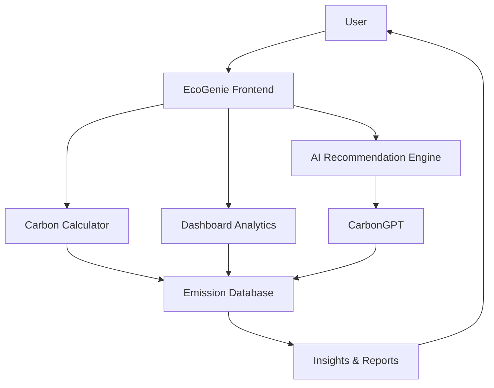

# 🌱 EcoGenie – AI-Powered Personal Carbon Footprint Assistant

<div align="center">


### Track • Understand • Reduce • Sustain

**Empowering individuals to make environmentally conscious decisions through AI-driven insights and personalized carbon reduction strategies.**

🔗 **Live Demo:** https://sweetyvincent.github.io/ecogenie-app/

</div>

---

## 📌 Problem Statement

Climate change is a global challenge, yet most individuals struggle to understand how their daily activities contribute to carbon emissions. Existing solutions often provide generic information without actionable guidance, making it difficult for users to adopt sustainable habits.

**Challenge:**

> Design a solution that helps individuals understand, track, and reduce their carbon footprint through simple actions and personalized insights.

---

## 💡 Solution Overview

**EcoGenie** is an AI-powered sustainability platform designed to transform complex carbon emission data into meaningful and actionable insights. By analyzing user lifestyle habits such as transportation, energy consumption, food choices, shopping behavior, and waste generation, EcoGenie calculates a personalized carbon footprint and provides tailored recommendations to reduce environmental impact.

The platform combines Artificial Intelligence, Data Analytics, Gamification, and Sustainability Education to encourage long-term eco-friendly behavior.

---

## 🎯 Objectives

- Help users understand their carbon footprint.
- Track carbon emissions across different lifestyle categories.
- Provide personalized recommendations for reducing emissions.
- Encourage sustainable habits through gamification.
- Create awareness about climate responsibility.
- Promote measurable environmental impact at an individual level.

---

## ✨ Key Features

### 🌍 Carbon Footprint Calculator

Calculate carbon emissions based on:

- 🚗 Transportation Habits
- ⚡ Electricity Consumption
- 🍔 Food & Dietary Choices
- 🛍 Shopping Behavior
- ♻ Waste Generation
- 💧 Water Usage

Users receive:

- Daily Carbon Score
- Weekly Reports
- Monthly Analytics
- Annual Impact Summary

---

### 🤖 AI Sustainability Coach

An intelligent assistant that provides:

- Personalized eco-friendly recommendations
- Lifestyle improvement suggestions
- Sustainability roadmaps
- Carbon reduction action plans

#### Example Suggestions

- Use public transport twice this week.
- Reduce AC usage by one hour daily.
- Replace disposable bottles with reusable alternatives.
- Switch to LED lighting.

---

### 📊 Interactive Dashboard

A centralized dashboard displaying:

- Carbon Emission Breakdown
- Emission Trends
- Sustainability Score
- Progress Tracking
- Goal Achievement Status

---

### 🎯 Carbon Reduction Simulator

Allows users to simulate lifestyle changes before adopting them.

#### Example:

**What happens if I bike instead of driving?**

Results include:

- Carbon Emissions Saved
- Money Saved
- Fuel Saved
- Equivalent Trees Planted

---

### 🏆 Gamification System

Encourages engagement through:

- Eco Points
- Achievement Badges
- Sustainability Levels
- Daily Streaks
- Community Leaderboards

---

### 👥 Community & Challenges

Users can participate in:

- Green Challenges
- Community Competitions
- Sustainability Campaigns
- Environmental Awareness Events

---

## 🧠 AI Components

### CarbonGPT

An AI-powered sustainability assistant capable of:

- Explaining carbon emissions
- Answering climate-related questions
- Providing sustainability guidance
- Offering personalized recommendations

---

### Smart Recommendation Engine

Uses behavioral analysis to:

- Detect high-emission activities
- Identify improvement opportunities
- Generate custom sustainability plans

---

### Predictive Carbon Analytics

Forecasts future emissions using:

- Historical activity data
- User behavior patterns
- Lifestyle trends

---

## 🏗 System Architecture



---

## 🛠 Technology Stack

### Frontend

- HTML5
- CSS3
- JavaScript
- Responsive Design

### Backend

- Python
- FastAPI (REST API Services, AI recommendations, OCR calculations, and CarbonGPT)

### Database

- PostgreSQL (Relational schema with custom aggregation views)

### Artificial Intelligence

- OpenAI GPT Models
- Recommendation Systems
- Predictive Analytics

### Deployment

- GitHub Pages

---

## 📂 Project Structure

```text
ecogenie-app/
│
├── index.html
├── styles.css
├── script.js
├── assets/
│   ├── images/
│   ├── icons/
│   └── illustrations/
│
├── README.md
│
└── docs/
```

---

## 🚀 Getting Started

### Clone the Repository

```bash
git clone https://github.com/SweetyVincent/ecogenie-app.git
```

### Navigate to Project Directory

```bash
cd ecogenie-app
```

### Run Locally

Simply open:

```bash
index.html
```

Or use VS Code Live Server for development.

### Running Tests

#### Frontend Unit Tests
To run the carbon calculator core engine unit tests:
```bash
npm install
npm test
```

#### Backend Unit Tests
To run the FastAPI backend API unit tests:
```bash
cd backend
pip install -r requirements.txt
python -m pytest test_main.py
```

---

## 📈 Expected Impact

EcoGenie helps users:

✅ Understand their environmental impact

✅ Develop sustainable habits

✅ Reduce carbon emissions

✅ Make data-driven lifestyle choices

✅ Contribute towards climate action goals

---

## 🌍 Sustainability Benefits

Through small lifestyle changes, users can:

- Reduce greenhouse gas emissions
- Save energy and resources
- Lower transportation emissions
- Minimize waste generation
- Build long-term sustainable habits

---

## 🔮 Future Enhancements

### AI Receipt Scanner

Scan purchase receipts and estimate product-level carbon impact.

### Utility Bill Analyzer

Analyze electricity consumption patterns and suggest optimizations.

### Image-Based Carbon Tracking

Upload photos of meals, vehicles, or appliances to estimate emissions.

### Carbon Offset Marketplace

Support verified environmental projects and offset emissions.

### Mobile Application

Native Android and iOS applications.

### Smart Device Integration

Connect with IoT devices for real-time sustainability tracking.

---

## 🏆 Innovation Highlights

- AI-Powered Sustainability Assistant
- Personalized Carbon Reduction Plans
- Interactive Carbon Simulations
- Behavioral Analytics
- Gamified User Experience
- Scalable Architecture
- Future-Ready Smart Sustainability Ecosystem

---

## 👩‍💻 Developed By

### Sweety Vincent

**B.Tech – Artificial Intelligence & Data Science**  
Panimalar Engineering College

GitHub: https://github.com/SweetyVincent

---

## 📄 License

This project is licensed under the MIT License.

---

<div align="center">

## 🌱 Small Actions Today. Sustainable Future Tomorrow.

### EcoGenie – Your Personal Carbon Reduction Companion

</div>
