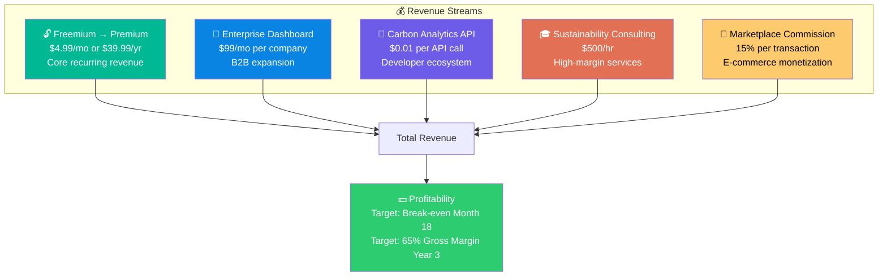
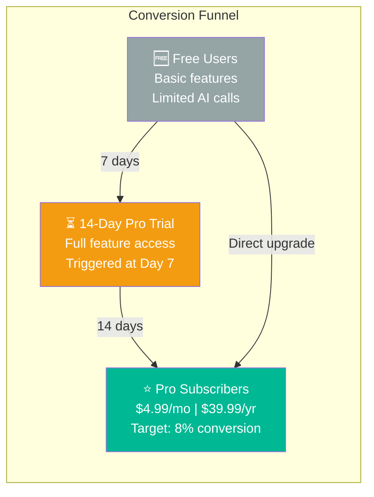
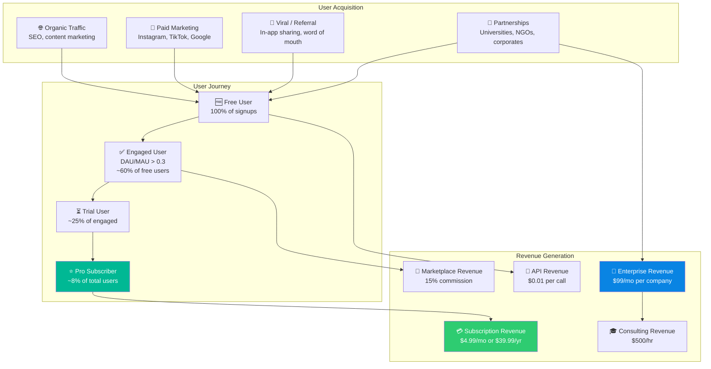
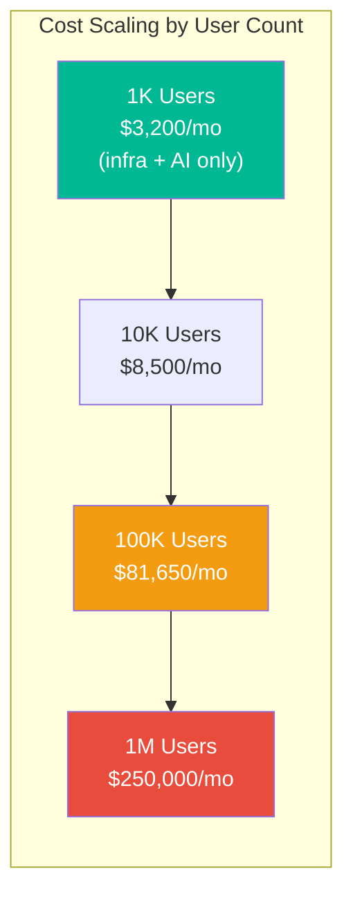
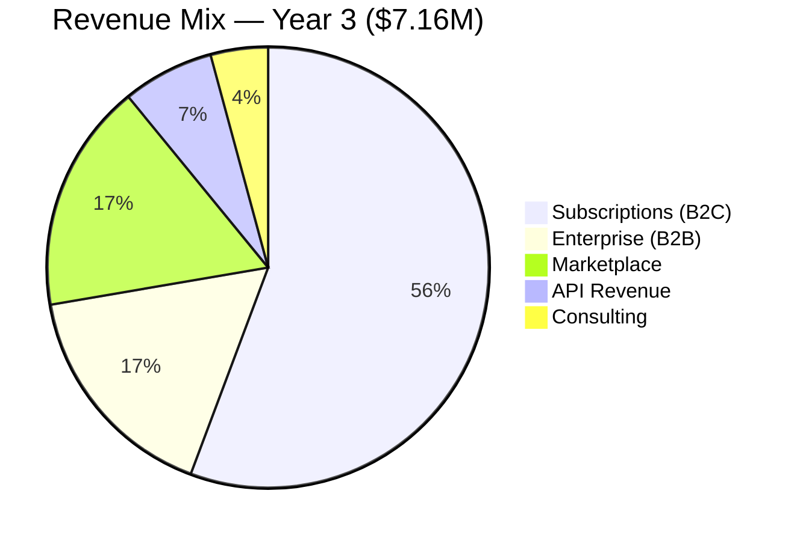
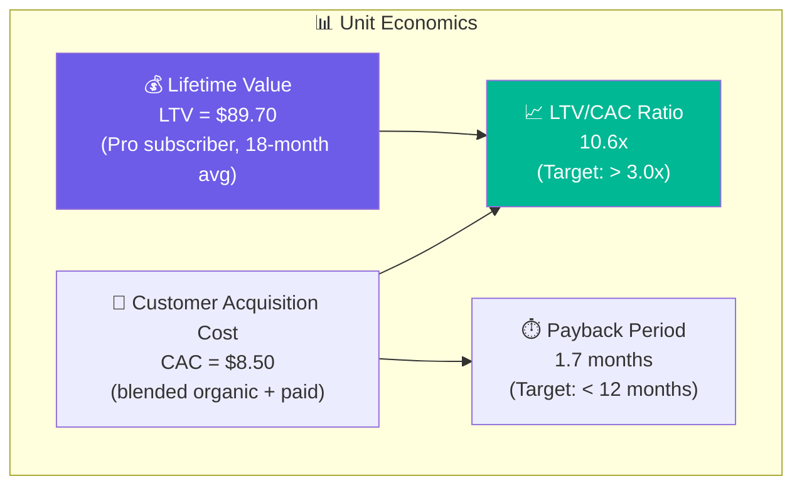
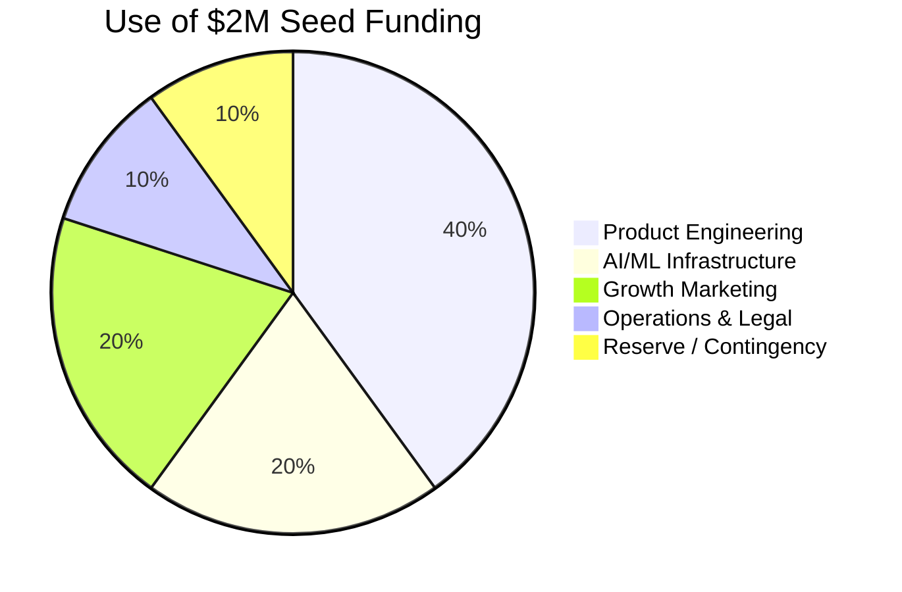
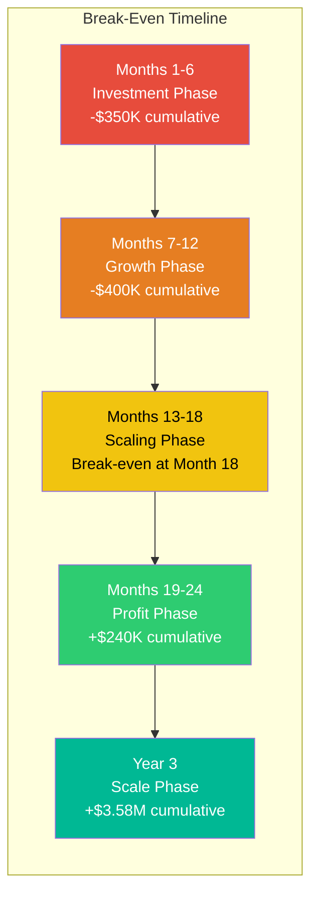

# 💰 Section 10 — Business Model & Financial Projections

> **EcoGenie — Personal Carbon Reduction Assistant**
> *Revenue Strategy, Unit Economics, and 3-Year Financial Forecast*

---

## 10.1 Business Model Overview

EcoGenie employs a **multi-stream revenue model** combining recurring subscription revenue with transactional and partnership income. This diversified approach ensures resilience and multiple growth vectors.

---

## 10.2 Revenue Stream Details

### Stream 1: Freemium → Premium Subscriptions

The **primary revenue driver** — converting free users to paying subscribers through demonstrated value.

### Stream 2: Enterprise Dashboard

B2B offering for companies wanting to track employee sustainability metrics as part of ESG programs.

| Feature | Description |
|---------|-------------|
| **Employee Carbon Tracking** | Aggregate dashboard for company-wide emissions |
| **Team Challenges** | Intra-company sustainability competitions |
| **ESG Reporting** | Automated reports for SEC/EU compliance |
| **Admin Panel** | Employee management and goal setting |
| **API Access** | Integrate with existing HR/ESG tools |

### Stream 3: Carbon Analytics API

Developer-facing API product for third-party applications needing carbon calculation capabilities.

| Tier | Calls/Month | Price | Target User |
|------|:-----------:|:-----:|-------------|
| Free | 1,000 | $0 | Hobbyist developers |
| Starter | 50,000 | $29/mo | Small apps |
| Growth | 500,000 | $199/mo | Medium businesses |
| Enterprise | Unlimited | Custom | Large enterprises |

### Stream 4: Sustainability Consulting

Premium advisory services leveraging EcoGenie's data and AI capabilities.

| Service | Duration | Price | Description |
|---------|----------|:-----:|-------------|
| Personal Carbon Audit | 2 hours | $1,000 | Deep-dive personal emission analysis |
| Family Sustainability Plan | 4 hours | $2,000 | Household optimization strategy |
| Corporate Workshop | Half-day | $5,000 | Employee sustainability training |
| Annual Sustainability Strategy | Ongoing | $25,000/yr | Quarterly reviews + goal tracking |

### Stream 5: Marketplace Commission

Revenue from eco-product sales through the integrated marketplace.

| Category | Avg. Order Value | Commission Rate | Avg. Commission |
|----------|:---:|:---:|:---:|
| Energy Products (Solar, LEDs) | $200 | 15% | $30 |
| Sustainable Fashion | $80 | 15% | $12 |
| Eco Home Products | $50 | 15% | $7.50 |
| Organic Food Subscriptions | $60 | 15% | $9 |
| Carbon Offset Credits | $40 | 15% | $6 |

---

## 10.3 Pricing Plans

| Feature | 🆓 **Free** | ⭐ **Pro** ($4.99/mo) | 🏢 **Enterprise** ($99/mo) |
|---------|:---:|:---:|:---:|
| **Carbon Calculator** | ✅ Unlimited | ✅ Unlimited | ✅ Unlimited |
| **Dashboard & Trends** | ✅ Basic (30 days) | ✅ Full history | ✅ Full + team view |
| **CarbonGPT Chat** | 5 messages/day | ✅ Unlimited | ✅ Unlimited |
| **AI Recommendations** | 3/month | ✅ Unlimited | ✅ Unlimited + team |
| **Receipt Scanning** | 3 scans/month | ✅ Unlimited | ✅ Unlimited |
| **Bill Analysis** | 1 bill/month | ✅ Unlimited | ✅ Unlimited |
| **Emission Predictions** | ❌ | ✅ 3-month forecast | ✅ 12-month forecast |
| **Carbon Simulator** | ❌ | ✅ Unlimited scenarios | ✅ Company scenarios |
| **Challenges** | 1 active | ✅ Unlimited | ✅ Custom challenges |
| **Leaderboard** | ✅ Global only | ✅ Global + Friends | ✅ Company + Global |
| **Community** | ✅ Read-only | ✅ Full access | ✅ Private community |
| **Marketplace** | ✅ Browse | ✅ Full access + discounts | ✅ Bulk ordering |
| **Achievements** | ✅ Basic badges | ✅ All badges | ✅ Custom badges |
| **Data Export** | ❌ | ✅ CSV/PDF | ✅ API + CSV/PDF |
| **ESG Reports** | ❌ | ❌ | ✅ Automated |
| **Admin Dashboard** | ❌ | ❌ | ✅ Full admin |
| **Priority Support** | ❌ | ✅ Email | ✅ Dedicated account mgr |
| **API Access** | ❌ | ❌ | ✅ Included |

---

## 10.4 Revenue Flow Diagram

---

## 10.5 Cost Analysis

### Monthly Operating Costs (at Scale: 100K Users)

| Category | Item | Monthly Cost | Annual Cost |
|----------|------|:---:|:---:|
| **Infrastructure** | AWS ECS (Compute) | $1,200 | $14,400 |
| | AWS RDS PostgreSQL | $450 | $5,400 |
| | AWS S3 Storage | $100 | $1,200 |
| | AWS CloudFront CDN | $150 | $1,800 |
| | Redis (ElastiCache) | $200 | $2,400 |
| | **Infra Subtotal** | **$2,100** | **$25,200** |
| **AI/ML Services** | OpenAI API (GPT-4o) | $3,500 | $42,000 |
| | Pinecone Vector DB | $250 | $3,000 |
| | ML Model Training (Compute) | $300 | $3,600 |
| | **AI Subtotal** | **$4,050** | **$48,600** |
| **Team (Phase 2)** | Full-Stack Engineers (3) | $30,000 | $360,000 |
| | ML Engineer (1) | $12,000 | $144,000 |
| | Product Manager (1) | $10,000 | $120,000 |
| | Designer (1) | $8,000 | $96,000 |
| | DevOps (1 part-time) | $5,000 | $60,000 |
| | **Team Subtotal** | **$65,000** | **$780,000** |
| **Marketing** | Paid Ads (Social, Search) | $5,000 | $60,000 |
| | Content Marketing | $2,000 | $24,000 |
| | PR & Events | $1,500 | $18,000 |
| | **Marketing Subtotal** | **$8,500** | **$102,000** |
| **Operations** | Legal & Compliance | $1,000 | $12,000 |
| | Tools & SaaS (Clerk, analytics) | $500 | $6,000 |
| | Miscellaneous | $500 | $6,000 |
| | **Ops Subtotal** | **$2,000** | **$24,000** |
| | | | |
| | **TOTAL MONTHLY** | **$81,650** | **$979,800** |

### Cost Scaling Model

---

## 10.6 Three-Year Financial Projections

### Revenue Projection

| Metric | **Year 1** | **Year 2** | **Year 3** |
|--------|:---:|:---:|:---:|
| **Total Users** | 50,000 | 250,000 | 1,000,000 |
| **Paid Subscribers (8%)** | 4,000 | 20,000 | 80,000 |
| **Enterprise Clients** | 5 | 25 | 100 |
| **API Customers** | 10 | 50 | 200 |
| | | | |
| **Subscription Revenue** | $199,600 | $998,000 | $3,992,000 |
| **Enterprise Revenue** | $59,400 | $297,000 | $1,188,000 |
| **API Revenue** | $6,000 | $60,000 | $480,000 |
| **Marketplace Commission** | $30,000 | $225,000 | $1,200,000 |
| **Consulting Revenue** | $25,000 | $100,000 | $300,000 |
| | | | |
| **Total Revenue** | **$320,000** | **$1,680,000** | **$7,160,000** |
| **Total Costs** | **$720,000** | **$1,440,000** | **$3,580,000** |
| **Net Income** | **-$400,000** | **$240,000** | **$3,580,000** |
| **Gross Margin** | -125% | 14.3% | **50.0%** |

### Revenue Growth Visualization

### Monthly Revenue Projection (Year 1)

| Month | New Users | Total Users | Paid Users | MRR | Cumulative Revenue |
|:-----:|:---------:|:-----------:|:----------:|:---:|:------------------:|
| 1 | 500 | 500 | 20 | $100 | $100 |
| 2 | 800 | 1,300 | 65 | $325 | $425 |
| 3 | 1,200 | 2,500 | 150 | $749 | $1,174 |
| 4 | 2,000 | 4,500 | 315 | $1,572 | $2,746 |
| 5 | 3,000 | 7,500 | 525 | $2,620 | $5,366 |
| 6 | 4,000 | 11,500 | 920 | $4,593 | $9,959 |
| 7 | 5,000 | 16,500 | 1,320 | $6,587 | $16,546 |
| 8 | 6,000 | 22,500 | 1,800 | $8,982 | $25,528 |
| 9 | 6,500 | 29,000 | 2,320 | $11,577 | $37,105 |
| 10 | 7,000 | 36,000 | 2,880 | $14,371 | $51,476 |
| 11 | 7,000 | 43,000 | 3,440 | $17,166 | $68,642 |
| 12 | 7,000 | 50,000 | 4,000 | $19,960 | $88,602 |

> *Note: MRR includes subscription revenue only. Annual subscriptions amortized monthly.*

---

## 10.7 Unit Economics

### Detailed Unit Economics

| Metric | Value | Calculation |
|--------|:-----:|-------------|
| **Customer Acquisition Cost (CAC)** | **$8.50** | Total marketing spend / new users |
| — Organic CAC | $2.00 | SEO, content, viral (60% of users) |
| — Paid CAC | $18.00 | Social ads, Google ads (40% of users) |
| — Blended CAC | $8.50 | Weighted average |
| | | |
| **Monthly Churn Rate** | **4.5%** | Pro subscribers canceling per month |
| **Average Subscription Duration** | **18 months** | 1 / churn rate (rounded) |
| | | |
| **Average Revenue Per User (ARPU)** | **$4.99/mo** | Monthly subscription price |
| **Lifetime Value (LTV)** | **$89.70** | ARPU × Avg. duration |
| | | |
| **LTV / CAC Ratio** | **10.6x** | $89.70 / $8.50 |
| **Payback Period** | **1.7 months** | CAC / ARPU |
| | | |
| **Gross Margin Per User** | **72%** | After variable costs (AI API, hosting) |
| **Variable Cost Per User/Month** | **$1.40** | AI calls ($0.80) + hosting ($0.35) + other ($0.25) |
| **Contribution Margin** | **$3.59/mo** | ARPU - Variable Costs |

### Cohort Retention Curve

| Month | Retention Rate | Users Remaining (per 100) |
|:-----:|:--------------:|:-------------------------:|
| 0 | 100% | 100 |
| 1 | 88% | 88 |
| 2 | 82% | 82 |
| 3 | 78% | 78 |
| 6 | 70% | 70 |
| 9 | 64% | 64 |
| 12 | 58% | 58 |
| 18 | 50% | 50 |
| 24 | 44% | 44 |

---

## 10.8 Funding Strategy

### Seed Round: $2M

| Category | Amount | Purpose |
|----------|:------:|---------|
| Product Engineering | $800,000 | 3 full-stack engineers + 1 designer for 12 months |
| AI/ML Infrastructure | $400,000 | ML engineer + OpenAI/Pinecone costs + model development |
| Growth Marketing | $400,000 | User acquisition, content, partnerships, campus programs |
| Operations & Legal | $200,000 | Legal, compliance, accounting, office |
| Reserve | $200,000 | Buffer for unexpected costs, runway extension |

### Expected Milestones at Seed

| Milestone | Target | Timeline |
|-----------|--------|----------|
| Active Users | 50,000 | Month 12 |
| Paid Subscribers | 4,000 | Month 12 |
| MRR | $20,000 | Month 12 |
| Enterprise Clients | 5 | Month 12 |
| CarbonGPT Queries | 500K | Cumulative Year 1 |

### Series A Trigger Metrics

| Metric | Target for Series A |
|--------|:---:|
| Active Users | > 100,000 |
| MRR | > $50,000 |
| LTV/CAC | > 8x |
| Month-over-Month Growth | > 15% |
| Net Revenue Retention | > 110% |
| Enterprise Pipeline | 20+ qualified leads |

---

## 10.9 Break-Even Analysis

| Break-Even Metric | Value |
|-------------------|:-----:|
| **Break-Even Month** | Month 18 |
| **Break-Even Users** | ~150,000 |
| **Break-Even MRR** | ~$60,000 |
| **Required Paid Users** | ~12,000 |
| **Cumulative Investment to Break-Even** | ~$1.1M |

---

## 10.10 Risk Mitigation

| Risk | Probability | Impact | Mitigation |
|------|:---:|:---:|------------|
| Low conversion rate (< 5%) | Medium | High | A/B test paywalls, improve free→trial funnel, add more Pro features |
| High churn (> 8%/mo) | Low | High | Increase engagement via gamification, push notifications, streaks |
| OpenAI API cost increase | Medium | Medium | Implement caching, fine-tune smaller models, explore open-source LLMs |
| Competitor entry (Google, Apple) | Low | High | Build community moat, niche specialization, partnership lock-in |
| Regulatory changes | Low | Medium | Stay compliant, modular architecture allows quick adaptation |
| Slow enterprise adoption | Medium | Medium | Focus on B2C first, build enterprise case studies, hire enterprise sales |

---

**© 2026 EcoGenie — Business Model Document v1.0**
