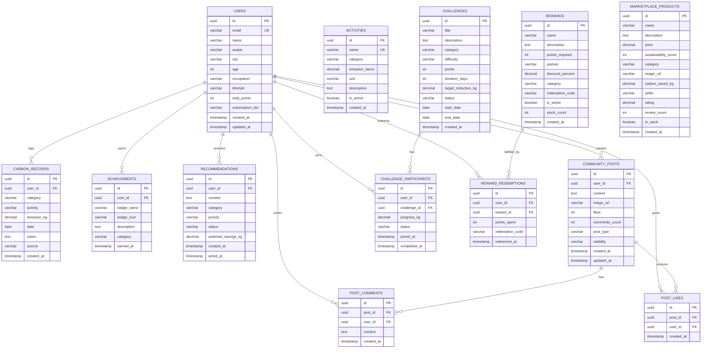
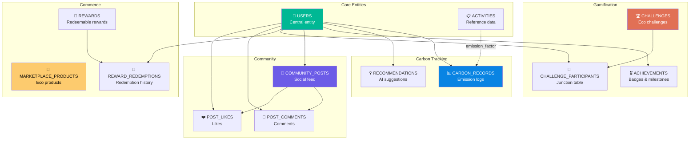
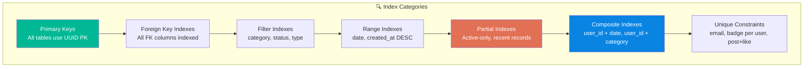
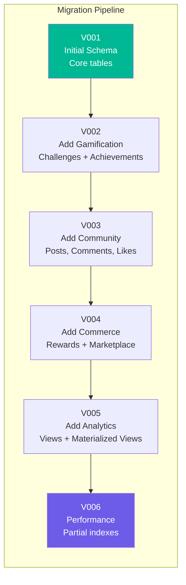

# 🗄️ Section 6 — Database Design

> **EcoGenie — Personal Carbon Reduction Assistant**
> *Complete Database Schema, ER Diagram, and Data Model Documentation*

---

## 6.1 Database Overview

EcoGenie uses **PostgreSQL 16** as its primary relational database, chosen for its robustness, extensibility, JSON support, and excellent performance with analytical queries.

### Database Statistics

| Metric | Value |
|--------|-------|
| **Total Tables** | 9 core + 4 junction/auxiliary |
| **Storage Engine** | PostgreSQL 16 |
| **Character Set** | UTF-8 |
| **Collation** | en_US.UTF-8 |
| **Expected Data Growth** | ~500 MB/month at 10K users |
| **Backup Strategy** | Automated daily snapshots + WAL archiving |

---

## 6.2 Entity-Relationship Diagram



---

## 6.3 Table Relationship Map



---

## 6.4 SQL CREATE TABLE Statements

### 6.4.1 Users Table

```sql
-- =====================================================
-- TABLE: users
-- Description: Core user profiles and account data
-- =====================================================
CREATE TABLE users (
    id              UUID PRIMARY KEY DEFAULT gen_random_uuid(),
    email           VARCHAR(255) NOT NULL UNIQUE,
    name            VARCHAR(150) NOT NULL,
    avatar          VARCHAR(500),
    city            VARCHAR(100),
    age             INTEGER CHECK (age >= 13 AND age <= 120),
    occupation      VARCHAR(100),
    lifestyle       VARCHAR(50) CHECK (lifestyle IN (
                        'sedentary', 'moderate', 'active',
                        'eco-conscious', 'high-consumption'
                    )),
    total_points    INTEGER NOT NULL DEFAULT 0,
    subscription_tier VARCHAR(20) NOT NULL DEFAULT 'free'
                    CHECK (subscription_tier IN ('free', 'pro', 'enterprise')),
    clerk_user_id   VARCHAR(255) UNIQUE,
    onboarding_completed BOOLEAN NOT NULL DEFAULT FALSE,
    created_at      TIMESTAMP WITH TIME ZONE NOT NULL DEFAULT NOW(),
    updated_at      TIMESTAMP WITH TIME ZONE NOT NULL DEFAULT NOW()
);

-- Indexes
CREATE INDEX idx_users_email ON users (email);
CREATE INDEX idx_users_city ON users (city);
CREATE INDEX idx_users_clerk_id ON users (clerk_user_id);
CREATE INDEX idx_users_subscription ON users (subscription_tier);
CREATE INDEX idx_users_created_at ON users (created_at);

-- Updated_at trigger
CREATE OR REPLACE FUNCTION update_updated_at_column()
RETURNS TRIGGER AS $$
BEGIN
    NEW.updated_at = NOW();
    RETURN NEW;
END;
$$ LANGUAGE plpgsql;

CREATE TRIGGER trigger_users_updated_at
    BEFORE UPDATE ON users
    FOR EACH ROW
    EXECUTE FUNCTION update_updated_at_column();
```

### 6.4.2 Carbon Records Table

```sql
-- =====================================================
-- TABLE: carbon_records
-- Description: Individual carbon emission log entries
-- =====================================================
CREATE TABLE carbon_records (
    id              UUID PRIMARY KEY DEFAULT gen_random_uuid(),
    user_id         UUID NOT NULL REFERENCES users(id) ON DELETE CASCADE,
    category        VARCHAR(50) NOT NULL CHECK (category IN (
                        'transport', 'energy', 'food', 'shopping',
                        'waste', 'water', 'digital', 'other'
                    )),
    activity        VARCHAR(200) NOT NULL,
    emission_kg     DECIMAL(10, 4) NOT NULL CHECK (emission_kg >= 0),
    date            DATE NOT NULL DEFAULT CURRENT_DATE,
    notes           TEXT,
    source          VARCHAR(50) DEFAULT 'manual' CHECK (source IN (
                        'manual', 'receipt_scan', 'bill_scan',
                        'api', 'prediction', 'iot'
                    )),
    created_at      TIMESTAMP WITH TIME ZONE NOT NULL DEFAULT NOW()
);

-- Indexes for common query patterns
CREATE INDEX idx_carbon_records_user_id ON carbon_records (user_id);
CREATE INDEX idx_carbon_records_date ON carbon_records (date DESC);
CREATE INDEX idx_carbon_records_category ON carbon_records (category);
CREATE INDEX idx_carbon_records_user_date ON carbon_records (user_id, date DESC);
CREATE INDEX idx_carbon_records_user_category ON carbon_records (user_id, category);
CREATE INDEX idx_carbon_records_user_date_range ON carbon_records (user_id, date)
    WHERE date >= CURRENT_DATE - INTERVAL '1 year';

-- Partial index for recent records (performance optimization)
CREATE INDEX idx_carbon_records_recent ON carbon_records (user_id, created_at DESC)
    WHERE created_at >= CURRENT_DATE - INTERVAL '30 days';
```

### 6.4.3 Activities Table

```sql
-- =====================================================
-- TABLE: activities
-- Description: Reference table of activities with emission factors
-- =====================================================
CREATE TABLE activities (
    id              UUID PRIMARY KEY DEFAULT gen_random_uuid(),
    name            VARCHAR(200) NOT NULL UNIQUE,
    category        VARCHAR(50) NOT NULL CHECK (category IN (
                        'transport', 'energy', 'food', 'shopping',
                        'waste', 'water', 'digital', 'other'
                    )),
    emission_factor DECIMAL(10, 6) NOT NULL CHECK (emission_factor >= 0),
    unit            VARCHAR(50) NOT NULL,
    description     TEXT,
    is_active       BOOLEAN NOT NULL DEFAULT TRUE,
    data_source     VARCHAR(200),
    last_verified   DATE,
    created_at      TIMESTAMP WITH TIME ZONE NOT NULL DEFAULT NOW()
);

-- Indexes
CREATE INDEX idx_activities_category ON activities (category);
CREATE INDEX idx_activities_name ON activities (name);
CREATE INDEX idx_activities_active ON activities (is_active) WHERE is_active = TRUE;

-- Seed data examples
COMMENT ON TABLE activities IS 'Reference table containing emission factors for various activities. Sources include EPA, DEFRA, IPCC.';
```

### 6.4.4 Challenges Table

```sql
-- =====================================================
-- TABLE: challenges
-- Description: Eco-challenges users can join and complete
-- =====================================================
CREATE TABLE challenges (
    id                  UUID PRIMARY KEY DEFAULT gen_random_uuid(),
    title               VARCHAR(200) NOT NULL,
    description         TEXT NOT NULL,
    category            VARCHAR(50) NOT NULL CHECK (category IN (
                            'transport', 'energy', 'food', 'shopping',
                            'waste', 'water', 'lifestyle', 'community'
                        )),
    difficulty          VARCHAR(20) NOT NULL CHECK (difficulty IN (
                            'beginner', 'intermediate', 'advanced', 'expert'
                        )),
    points              INTEGER NOT NULL CHECK (points > 0),
    duration_days       INTEGER NOT NULL CHECK (duration_days > 0),
    target_reduction_kg DECIMAL(10, 2) NOT NULL CHECK (target_reduction_kg > 0),
    max_participants    INTEGER,
    status              VARCHAR(20) NOT NULL DEFAULT 'active'
                        CHECK (status IN ('draft', 'active', 'completed', 'archived')),
    start_date          DATE,
    end_date            DATE,
    created_by          UUID REFERENCES users(id),
    created_at          TIMESTAMP WITH TIME ZONE NOT NULL DEFAULT NOW(),
    
    CONSTRAINT chk_date_range CHECK (end_date IS NULL OR end_date > start_date)
);

-- Indexes
CREATE INDEX idx_challenges_category ON challenges (category);
CREATE INDEX idx_challenges_difficulty ON challenges (difficulty);
CREATE INDEX idx_challenges_status ON challenges (status);
CREATE INDEX idx_challenges_active ON challenges (status, start_date, end_date)
    WHERE status = 'active';
```

### 6.4.5 Achievements Table

```sql
-- =====================================================
-- TABLE: achievements
-- Description: Badges and milestones earned by users
-- =====================================================
CREATE TABLE achievements (
    id              UUID PRIMARY KEY DEFAULT gen_random_uuid(),
    user_id         UUID NOT NULL REFERENCES users(id) ON DELETE CASCADE,
    badge_name      VARCHAR(100) NOT NULL,
    badge_icon      VARCHAR(50) NOT NULL,
    description     TEXT NOT NULL,
    category        VARCHAR(50) CHECK (category IN (
                        'milestone', 'streak', 'challenge',
                        'community', 'special', 'seasonal'
                    )),
    rarity          VARCHAR(20) DEFAULT 'common' CHECK (rarity IN (
                        'common', 'uncommon', 'rare', 'epic', 'legendary'
                    )),
    earned_at       TIMESTAMP WITH TIME ZONE NOT NULL DEFAULT NOW(),
    
    CONSTRAINT uq_user_badge UNIQUE (user_id, badge_name)
);

-- Indexes
CREATE INDEX idx_achievements_user_id ON achievements (user_id);
CREATE INDEX idx_achievements_badge ON achievements (badge_name);
CREATE INDEX idx_achievements_earned ON achievements (earned_at DESC);
CREATE INDEX idx_achievements_user_category ON achievements (user_id, category);
```

### 6.4.6 Recommendations Table

```sql
-- =====================================================
-- TABLE: recommendations
-- Description: AI-generated personalized recommendations
-- =====================================================
CREATE TABLE recommendations (
    id                  UUID PRIMARY KEY DEFAULT gen_random_uuid(),
    user_id             UUID NOT NULL REFERENCES users(id) ON DELETE CASCADE,
    content             TEXT NOT NULL,
    category            VARCHAR(50) NOT NULL CHECK (category IN (
                            'transport', 'energy', 'food', 'shopping',
                            'waste', 'water', 'lifestyle', 'general'
                        )),
    priority            VARCHAR(20) NOT NULL DEFAULT 'medium'
                        CHECK (priority IN ('low', 'medium', 'high', 'critical')),
    status              VARCHAR(20) NOT NULL DEFAULT 'pending'
                        CHECK (status IN (
                            'pending', 'viewed', 'accepted',
                            'completed', 'dismissed'
                        )),
    potential_savings_kg DECIMAL(10, 2),
    ai_model_version    VARCHAR(50),
    confidence_score    DECIMAL(5, 4) CHECK (confidence_score >= 0 AND confidence_score <= 1),
    created_at          TIMESTAMP WITH TIME ZONE NOT NULL DEFAULT NOW(),
    acted_at            TIMESTAMP WITH TIME ZONE
);

-- Indexes
CREATE INDEX idx_recommendations_user_id ON recommendations (user_id);
CREATE INDEX idx_recommendations_status ON recommendations (status);
CREATE INDEX idx_recommendations_priority ON recommendations (user_id, priority);
CREATE INDEX idx_recommendations_pending ON recommendations (user_id, created_at DESC)
    WHERE status = 'pending';
```

### 6.4.7 Community Posts Table

```sql
-- =====================================================
-- TABLE: community_posts
-- Description: Social feed posts shared by users
-- =====================================================
CREATE TABLE community_posts (
    id              UUID PRIMARY KEY DEFAULT gen_random_uuid(),
    user_id         UUID NOT NULL REFERENCES users(id) ON DELETE CASCADE,
    content         TEXT NOT NULL CHECK (char_length(content) <= 2000),
    image_url       VARCHAR(500),
    likes           INTEGER NOT NULL DEFAULT 0 CHECK (likes >= 0),
    comments_count  INTEGER NOT NULL DEFAULT 0 CHECK (comments_count >= 0),
    post_type       VARCHAR(30) DEFAULT 'general' CHECK (post_type IN (
                        'general', 'achievement', 'tip', 'challenge',
                        'milestone', 'question'
                    )),
    visibility      VARCHAR(20) DEFAULT 'public' CHECK (visibility IN (
                        'public', 'friends', 'private'
                    )),
    is_pinned       BOOLEAN NOT NULL DEFAULT FALSE,
    is_flagged      BOOLEAN NOT NULL DEFAULT FALSE,
    created_at      TIMESTAMP WITH TIME ZONE NOT NULL DEFAULT NOW(),
    updated_at      TIMESTAMP WITH TIME ZONE NOT NULL DEFAULT NOW()
);

-- Indexes
CREATE INDEX idx_community_posts_user_id ON community_posts (user_id);
CREATE INDEX idx_community_posts_created ON community_posts (created_at DESC);
CREATE INDEX idx_community_posts_type ON community_posts (post_type);
CREATE INDEX idx_community_posts_feed ON community_posts (visibility, created_at DESC)
    WHERE visibility = 'public' AND is_flagged = FALSE;

-- Updated_at trigger
CREATE TRIGGER trigger_posts_updated_at
    BEFORE UPDATE ON community_posts
    FOR EACH ROW
    EXECUTE FUNCTION update_updated_at_column();
```

### 6.4.8 Rewards Table

```sql
-- =====================================================
-- TABLE: rewards
-- Description: Redeemable rewards from eco-partners
-- =====================================================
CREATE TABLE rewards (
    id              UUID PRIMARY KEY DEFAULT gen_random_uuid(),
    name            VARCHAR(200) NOT NULL,
    description     TEXT NOT NULL,
    points_required INTEGER NOT NULL CHECK (points_required > 0),
    partner         VARCHAR(200) NOT NULL,
    discount_percent DECIMAL(5, 2) CHECK (
                        discount_percent > 0 AND discount_percent <= 100
                    ),
    category        VARCHAR(50) NOT NULL CHECK (category IN (
                        'food', 'transport', 'shopping', 'energy',
                        'experience', 'donation', 'digital'
                    )),
    redemption_code VARCHAR(100),
    terms_conditions TEXT,
    is_active       BOOLEAN NOT NULL DEFAULT TRUE,
    stock_count     INTEGER CHECK (stock_count >= 0),
    valid_from      DATE,
    valid_until     DATE,
    created_at      TIMESTAMP WITH TIME ZONE NOT NULL DEFAULT NOW(),
    
    CONSTRAINT chk_reward_validity CHECK (
        valid_until IS NULL OR valid_until > valid_from
    )
);

-- Indexes
CREATE INDEX idx_rewards_category ON rewards (category);
CREATE INDEX idx_rewards_points ON rewards (points_required);
CREATE INDEX idx_rewards_active ON rewards (is_active, category)
    WHERE is_active = TRUE;
CREATE INDEX idx_rewards_partner ON rewards (partner);
```

### 6.4.9 Marketplace Products Table

```sql
-- =====================================================
-- TABLE: marketplace_products
-- Description: Eco-friendly products available in the marketplace
-- =====================================================
CREATE TABLE marketplace_products (
    id                  UUID PRIMARY KEY DEFAULT gen_random_uuid(),
    name                VARCHAR(200) NOT NULL,
    description         TEXT NOT NULL,
    price               DECIMAL(10, 2) NOT NULL CHECK (price > 0),
    sustainability_score INTEGER NOT NULL CHECK (
                            sustainability_score >= 1 AND sustainability_score <= 100
                        ),
    category            VARCHAR(50) NOT NULL CHECK (category IN (
                            'energy', 'transport', 'food', 'home',
                            'personal_care', 'fashion', 'technology', 'garden'
                        )),
    image_url           VARCHAR(500),
    carbon_saved_kg     DECIMAL(10, 2) NOT NULL DEFAULT 0
                        CHECK (carbon_saved_kg >= 0),
    seller              VARCHAR(200),
    rating              DECIMAL(3, 2) CHECK (rating >= 0 AND rating <= 5),
    review_count        INTEGER NOT NULL DEFAULT 0 CHECK (review_count >= 0),
    in_stock            BOOLEAN NOT NULL DEFAULT TRUE,
    affiliate_url       VARCHAR(500),
    eco_certifications  TEXT[],
    created_at          TIMESTAMP WITH TIME ZONE NOT NULL DEFAULT NOW(),
    updated_at          TIMESTAMP WITH TIME ZONE NOT NULL DEFAULT NOW()
);

-- Indexes
CREATE INDEX idx_products_category ON marketplace_products (category);
CREATE INDEX idx_products_sustainability ON marketplace_products (sustainability_score DESC);
CREATE INDEX idx_products_price ON marketplace_products (price);
CREATE INDEX idx_products_rating ON marketplace_products (rating DESC NULLS LAST);
CREATE INDEX idx_products_in_stock ON marketplace_products (in_stock, category)
    WHERE in_stock = TRUE;
CREATE INDEX idx_products_carbon_saved ON marketplace_products (carbon_saved_kg DESC);

-- Updated_at trigger
CREATE TRIGGER trigger_products_updated_at
    BEFORE UPDATE ON marketplace_products
    FOR EACH ROW
    EXECUTE FUNCTION update_updated_at_column();
```

---

## 6.5 Junction / Auxiliary Tables

### 6.5.1 Challenge Participants

```sql
-- =====================================================
-- TABLE: challenge_participants
-- Description: Tracks user participation in challenges
-- =====================================================
CREATE TABLE challenge_participants (
    id              UUID PRIMARY KEY DEFAULT gen_random_uuid(),
    user_id         UUID NOT NULL REFERENCES users(id) ON DELETE CASCADE,
    challenge_id    UUID NOT NULL REFERENCES challenges(id) ON DELETE CASCADE,
    progress_kg     DECIMAL(10, 2) NOT NULL DEFAULT 0 CHECK (progress_kg >= 0),
    status          VARCHAR(20) NOT NULL DEFAULT 'active'
                    CHECK (status IN ('active', 'completed', 'failed', 'withdrawn')),
    joined_at       TIMESTAMP WITH TIME ZONE NOT NULL DEFAULT NOW(),
    completed_at    TIMESTAMP WITH TIME ZONE,
    
    CONSTRAINT uq_user_challenge UNIQUE (user_id, challenge_id)
);

-- Indexes
CREATE INDEX idx_cp_user_id ON challenge_participants (user_id);
CREATE INDEX idx_cp_challenge_id ON challenge_participants (challenge_id);
CREATE INDEX idx_cp_status ON challenge_participants (status);
CREATE INDEX idx_cp_active ON challenge_participants (user_id, status)
    WHERE status = 'active';
```

### 6.5.2 Reward Redemptions

```sql
-- =====================================================
-- TABLE: reward_redemptions
-- Description: History of reward redemptions by users
-- =====================================================
CREATE TABLE reward_redemptions (
    id              UUID PRIMARY KEY DEFAULT gen_random_uuid(),
    user_id         UUID NOT NULL REFERENCES users(id) ON DELETE CASCADE,
    reward_id       UUID NOT NULL REFERENCES rewards(id) ON DELETE SET NULL,
    points_spent    INTEGER NOT NULL CHECK (points_spent > 0),
    redemption_code VARCHAR(100) NOT NULL,
    status          VARCHAR(20) NOT NULL DEFAULT 'active'
                    CHECK (status IN ('active', 'used', 'expired', 'refunded')),
    redeemed_at     TIMESTAMP WITH TIME ZONE NOT NULL DEFAULT NOW(),
    expires_at      TIMESTAMP WITH TIME ZONE
);

-- Indexes
CREATE INDEX idx_rr_user_id ON reward_redemptions (user_id);
CREATE INDEX idx_rr_reward_id ON reward_redemptions (reward_id);
CREATE INDEX idx_rr_redeemed ON reward_redemptions (redeemed_at DESC);
```

### 6.5.3 Post Comments

```sql
-- =====================================================
-- TABLE: post_comments
-- Description: Comments on community posts
-- =====================================================
CREATE TABLE post_comments (
    id              UUID PRIMARY KEY DEFAULT gen_random_uuid(),
    post_id         UUID NOT NULL REFERENCES community_posts(id) ON DELETE CASCADE,
    user_id         UUID NOT NULL REFERENCES users(id) ON DELETE CASCADE,
    content         TEXT NOT NULL CHECK (char_length(content) <= 500),
    is_flagged      BOOLEAN NOT NULL DEFAULT FALSE,
    created_at      TIMESTAMP WITH TIME ZONE NOT NULL DEFAULT NOW()
);

-- Indexes
CREATE INDEX idx_comments_post_id ON post_comments (post_id);
CREATE INDEX idx_comments_user_id ON post_comments (user_id);
CREATE INDEX idx_comments_created ON post_comments (post_id, created_at DESC);
```

### 6.5.4 Post Likes

```sql
-- =====================================================
-- TABLE: post_likes
-- Description: Like interactions on community posts
-- =====================================================
CREATE TABLE post_likes (
    id              UUID PRIMARY KEY DEFAULT gen_random_uuid(),
    post_id         UUID NOT NULL REFERENCES community_posts(id) ON DELETE CASCADE,
    user_id         UUID NOT NULL REFERENCES users(id) ON DELETE CASCADE,
    created_at      TIMESTAMP WITH TIME ZONE NOT NULL DEFAULT NOW(),
    
    CONSTRAINT uq_post_like UNIQUE (post_id, user_id)
);

-- Indexes
CREATE INDEX idx_likes_post_id ON post_likes (post_id);
CREATE INDEX idx_likes_user_id ON post_likes (user_id);
```

---

## 6.6 Database Views

```sql
-- =====================================================
-- VIEW: user_dashboard_summary
-- Description: Pre-aggregated dashboard data per user
-- =====================================================
CREATE VIEW user_dashboard_summary AS
SELECT
    u.id AS user_id,
    u.name,
    u.total_points,
    u.subscription_tier,
    COALESCE(SUM(cr.emission_kg), 0) AS total_emissions_kg,
    COALESCE(SUM(cr.emission_kg) FILTER (
        WHERE cr.date >= DATE_TRUNC('month', CURRENT_DATE)
    ), 0) AS monthly_emissions_kg,
    COALESCE(SUM(cr.emission_kg) FILTER (
        WHERE cr.date >= CURRENT_DATE - INTERVAL '7 days'
    ), 0) AS weekly_emissions_kg,
    COUNT(DISTINCT cr.id) AS total_records,
    COUNT(DISTINCT a.id) AS total_achievements,
    COUNT(DISTINCT cp.id) FILTER (
        WHERE cp.status = 'completed'
    ) AS challenges_completed
FROM users u
LEFT JOIN carbon_records cr ON u.id = cr.user_id
LEFT JOIN achievements a ON u.id = a.user_id
LEFT JOIN challenge_participants cp ON u.id = cp.user_id
GROUP BY u.id, u.name, u.total_points, u.subscription_tier;

-- =====================================================
-- VIEW: category_breakdown
-- Description: Emission breakdown by category per user
-- =====================================================
CREATE VIEW category_breakdown AS
SELECT
    user_id,
    category,
    SUM(emission_kg) AS total_kg,
    COUNT(*) AS record_count,
    AVG(emission_kg) AS avg_per_record,
    MAX(emission_kg) AS max_single_record,
    MIN(date) AS first_record,
    MAX(date) AS latest_record
FROM carbon_records
GROUP BY user_id, category;

-- =====================================================
-- VIEW: leaderboard
-- Description: Global leaderboard based on points and reduction
-- =====================================================
CREATE VIEW leaderboard AS
SELECT
    u.id AS user_id,
    u.name,
    u.avatar,
    u.city,
    u.total_points,
    COUNT(DISTINCT a.id) AS badge_count,
    COUNT(DISTINCT cp.id) FILTER (
        WHERE cp.status = 'completed'
    ) AS challenges_won,
    RANK() OVER (ORDER BY u.total_points DESC) AS global_rank
FROM users u
LEFT JOIN achievements a ON u.id = a.user_id
LEFT JOIN challenge_participants cp ON u.id = cp.user_id
GROUP BY u.id, u.name, u.avatar, u.city, u.total_points;
```

---

## 6.7 Index Strategy Summary



### Index Summary Table

| Table | Index Name | Columns | Type | Purpose |
|-------|-----------|---------|------|---------|
| users | idx_users_email | email | B-tree | Login lookup |
| users | idx_users_clerk_id | clerk_user_id | B-tree | Auth verification |
| carbon_records | idx_carbon_records_user_date | user_id, date DESC | Composite | Dashboard queries |
| carbon_records | idx_carbon_records_recent | user_id, created_at | Partial (30 days) | Recent activity feed |
| carbon_records | idx_carbon_records_user_category | user_id, category | Composite | Category breakdown |
| activities | idx_activities_active | is_active | Partial (TRUE) | Active activities only |
| challenges | idx_challenges_active | status, start_date, end_date | Partial (active) | Active challenge listing |
| achievements | uq_user_badge | user_id, badge_name | Unique | Prevent duplicate badges |
| recommendations | idx_recommendations_pending | user_id, created_at | Partial (pending) | Pending recommendations |
| community_posts | idx_community_posts_feed | visibility, created_at | Partial (public) | Public feed rendering |
| marketplace_products | idx_products_sustainability | sustainability_score DESC | B-tree | Sort by eco-score |
| post_likes | uq_post_like | post_id, user_id | Unique | One like per user per post |

---

## 6.8 Data Migration Strategy



### Alembic Migration Example

```python
# migrations/versions/001_initial_schema.py
"""Initial database schema

Revision ID: 001
Create Date: 2026-01-15
"""

from alembic import op
import sqlalchemy as sa
from sqlalchemy.dialects import postgresql

revision = '001'
down_revision = None
branch_labels = None
depends_on = None

def upgrade() -> None:
    # Create users table
    op.create_table(
        'users',
        sa.Column('id', postgresql.UUID(), server_default=sa.text('gen_random_uuid()'), primary_key=True),
        sa.Column('email', sa.String(255), nullable=False, unique=True),
        sa.Column('name', sa.String(150), nullable=False),
        sa.Column('avatar', sa.String(500)),
        sa.Column('city', sa.String(100)),
        sa.Column('age', sa.Integer()),
        sa.Column('occupation', sa.String(100)),
        sa.Column('lifestyle', sa.String(50)),
        sa.Column('total_points', sa.Integer(), server_default='0', nullable=False),
        sa.Column('subscription_tier', sa.String(20), server_default='free', nullable=False),
        sa.Column('clerk_user_id', sa.String(255), unique=True),
        sa.Column('onboarding_completed', sa.Boolean(), server_default='false', nullable=False),
        sa.Column('created_at', sa.DateTime(timezone=True), server_default=sa.text('NOW()'), nullable=False),
        sa.Column('updated_at', sa.DateTime(timezone=True), server_default=sa.text('NOW()'), nullable=False),
    )
    
    # Create carbon_records table
    op.create_table(
        'carbon_records',
        sa.Column('id', postgresql.UUID(), server_default=sa.text('gen_random_uuid()'), primary_key=True),
        sa.Column('user_id', postgresql.UUID(), sa.ForeignKey('users.id', ondelete='CASCADE'), nullable=False),
        sa.Column('category', sa.String(50), nullable=False),
        sa.Column('activity', sa.String(200), nullable=False),
        sa.Column('emission_kg', sa.Numeric(10, 4), nullable=False),
        sa.Column('date', sa.Date(), server_default=sa.text('CURRENT_DATE'), nullable=False),
        sa.Column('notes', sa.Text()),
        sa.Column('source', sa.String(50), server_default='manual'),
        sa.Column('created_at', sa.DateTime(timezone=True), server_default=sa.text('NOW()'), nullable=False),
    )

def downgrade() -> None:
    op.drop_table('carbon_records')
    op.drop_table('users')
```

---

## 6.9 Sample Seed Data

```sql
-- =====================================================
-- SEED DATA: Activities reference table
-- =====================================================
INSERT INTO activities (name, category, emission_factor, unit, description) VALUES
    ('Car - Petrol (per km)', 'transport', 0.192, 'km', 'Average petrol car emission per kilometer'),
    ('Car - Diesel (per km)', 'transport', 0.171, 'km', 'Average diesel car emission per kilometer'),
    ('Car - Electric (per km)', 'transport', 0.053, 'km', 'Average EV emission per kilometer (grid mix)'),
    ('Bus (per km)', 'transport', 0.089, 'km', 'City bus per passenger-kilometer'),
    ('Train (per km)', 'transport', 0.041, 'km', 'Electric train per passenger-kilometer'),
    ('Domestic Flight (per km)', 'transport', 0.255, 'km', 'Domestic flight per passenger-kilometer'),
    ('International Flight (per km)', 'transport', 0.195, 'km', 'Long-haul flight per passenger-kilometer'),
    ('Bicycle', 'transport', 0.000, 'km', 'Zero direct emissions'),
    ('Electricity (per kWh)', 'energy', 0.233, 'kWh', 'Average grid electricity (US)'),
    ('Natural Gas (per kWh)', 'energy', 0.184, 'kWh', 'Natural gas heating per kWh'),
    ('Solar Panel (per kWh)', 'energy', 0.020, 'kWh', 'Solar PV lifecycle emissions'),
    ('Beef (per kg)', 'food', 27.0, 'kg', 'Beef production per kilogram'),
    ('Chicken (per kg)', 'food', 6.9, 'kg', 'Chicken production per kilogram'),
    ('Rice (per kg)', 'food', 2.7, 'kg', 'Rice production per kilogram'),
    ('Vegetables (per kg)', 'food', 0.4, 'kg', 'Average vegetable production per kilogram'),
    ('Fast Fashion T-Shirt', 'shopping', 7.0, 'item', 'Cotton t-shirt production + transport'),
    ('Smartphone', 'shopping', 70.0, 'item', 'Smartphone manufacturing lifecycle'),
    ('Laptop', 'shopping', 300.0, 'item', 'Laptop manufacturing lifecycle'),
    ('Plastic Waste (per kg)', 'waste', 2.5, 'kg', 'Plastic waste to landfill'),
    ('Food Waste (per kg)', 'waste', 2.0, 'kg', 'Food waste decomposition in landfill'),
    ('Streaming Video (per hour)', 'digital', 0.036, 'hour', 'Video streaming data center + network'),
    ('Cloud Storage (per GB/month)', 'digital', 0.010, 'GB', 'Cloud storage energy per GB monthly');

-- =====================================================
-- SEED DATA: Sample challenges
-- =====================================================
INSERT INTO challenges (title, description, category, difficulty, points, duration_days, target_reduction_kg, status) VALUES
    ('Meatless Monday Master', 'Go meat-free every Monday for a month', 'food', 'beginner', 100, 30, 12.0, 'active'),
    ('Zero Waste Week', 'Produce zero landfill waste for 7 days', 'waste', 'advanced', 200, 7, 5.0, 'active'),
    ('Public Transport Champion', 'Use only public transport for 2 weeks', 'transport', 'intermediate', 150, 14, 20.0, 'active'),
    ('Energy Saver Sprint', 'Reduce energy consumption by 15% this month', 'energy', 'intermediate', 175, 30, 15.0, 'active'),
    ('Digital Detox Weekend', 'Minimize screen time for 48 hours', 'digital', 'beginner', 75, 2, 0.5, 'active');
```

---

**© 2026 EcoGenie — Database Design Document v1.0**
