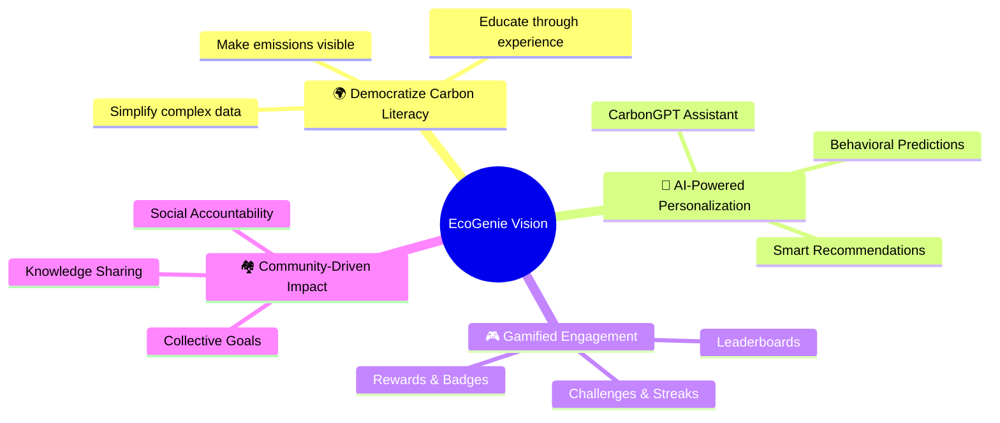
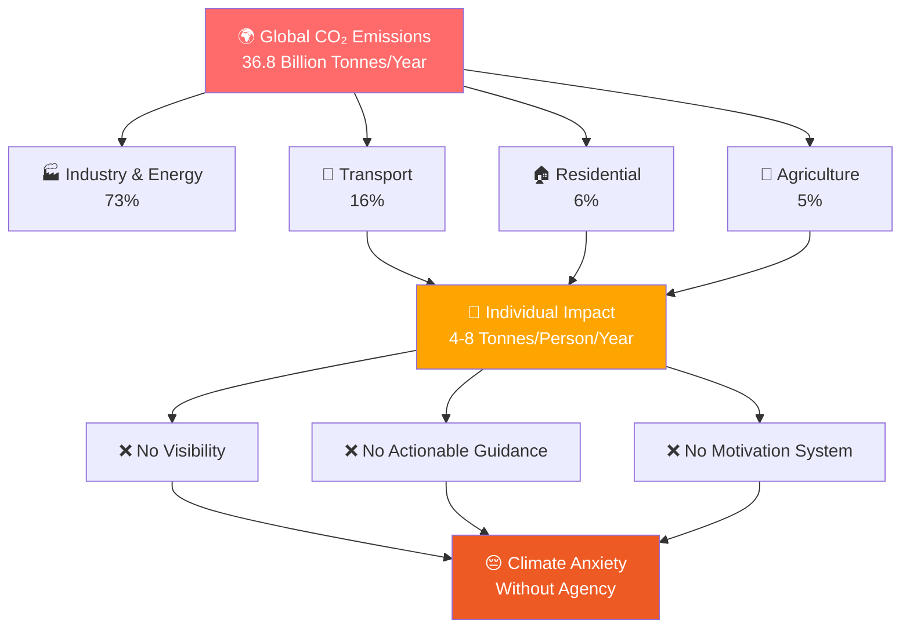
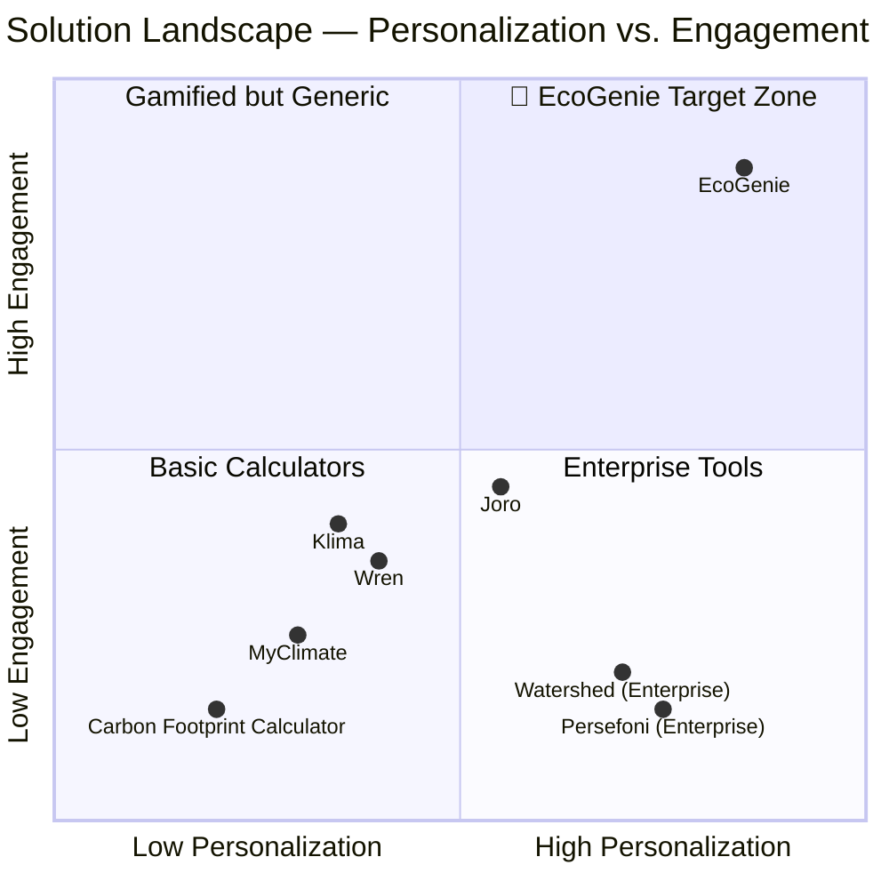
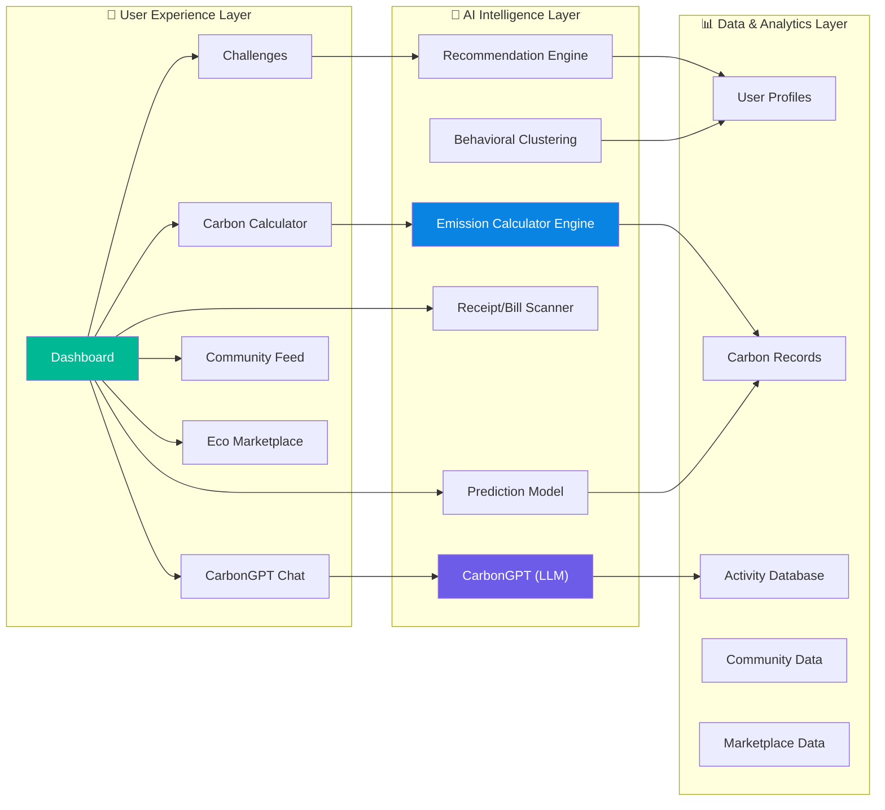
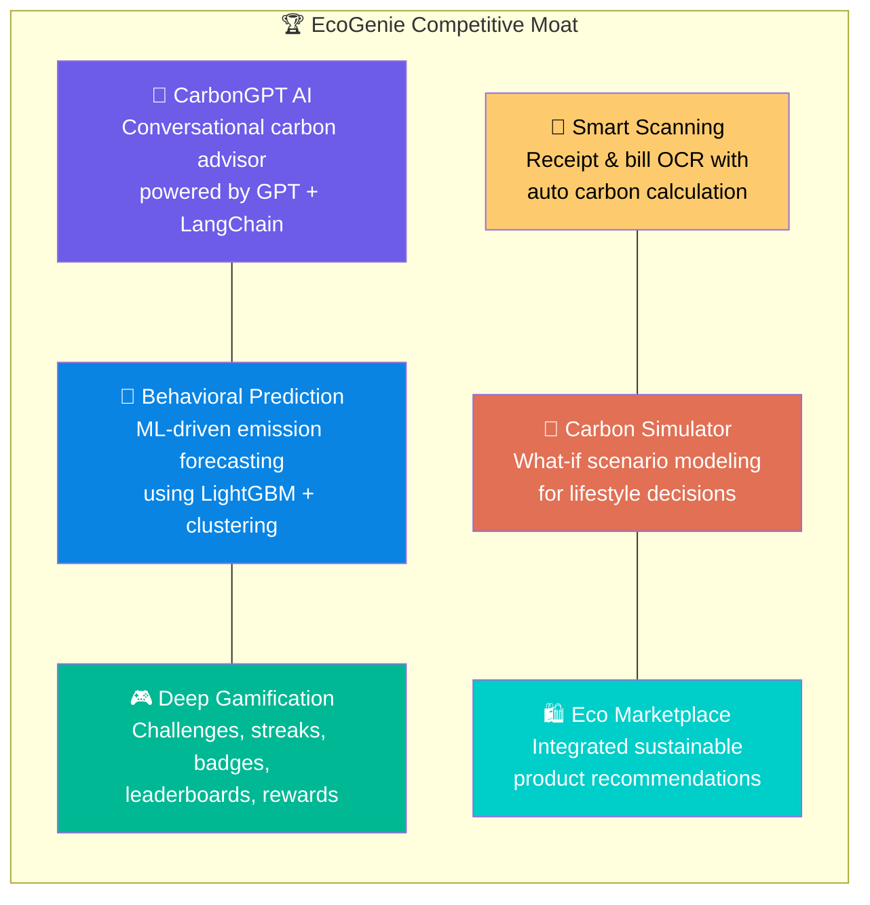
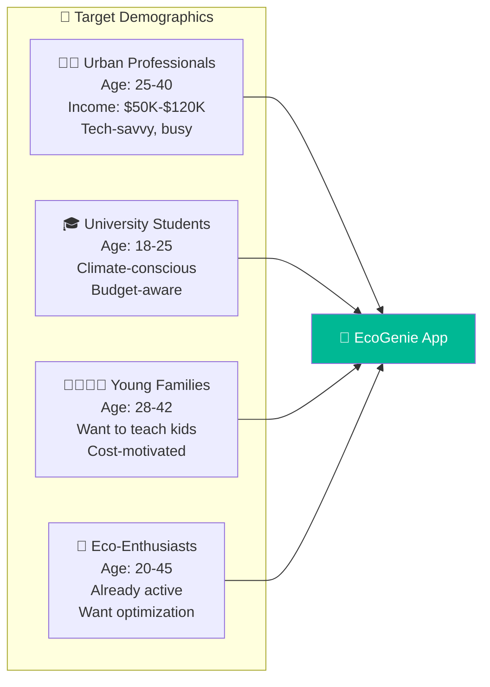
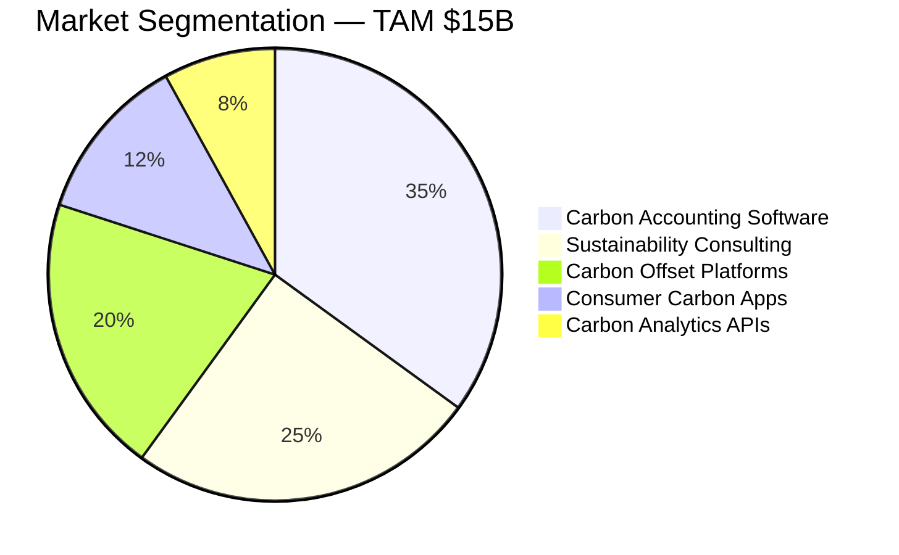
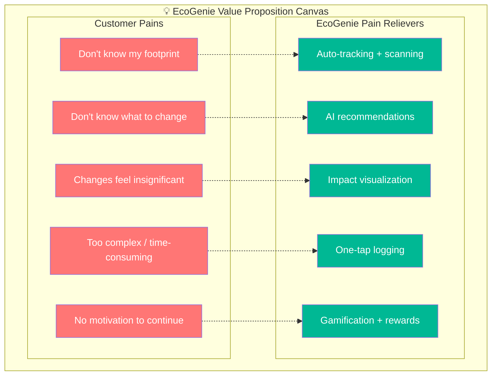
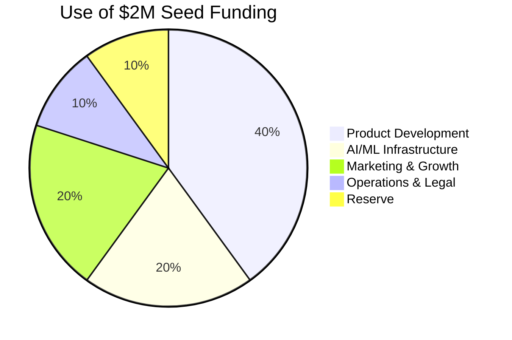

# 📋 Executive Summary — EcoGenie

> **Personal Carbon Reduction Assistant**
> *Democratizing carbon literacy. Making sustainability actionable for every individual on the planet.*

---

## 1. Project Vision

**EcoGenie envisions a world where every individual understands, tracks, and actively reduces their carbon footprint** — not through guilt or sacrifice, but through intelligent, personalized guidance powered by cutting-edge AI.

We believe that climate action begins with **carbon literacy**. When people can see the invisible — the emissions tied to their daily choices — they gain the power to change. EcoGenie transforms abstract carbon data into concrete, actionable habits, making sustainability as intuitive as checking the weather.

---

## 2. Mission Statement

> **Empower 1 billion people to measurably reduce their carbon footprint by 2030.**

EcoGenie is not just an app — it is a **movement**. Our mission is anchored in three pillars:

| Pillar | Description | Target Outcome |
|--------|-------------|----------------|
| **Awareness** | Make personal carbon data visible and understandable | 100% of users know their baseline footprint within 48 hrs |
| **Action** | Deliver AI-driven, personalized reduction strategies | 20% average reduction per user within 6 months |
| **Amplification** | Scale impact through community, gamification & partnerships | Viral coefficient > 1.3 via social features |

---

## 3. Problem Analysis

### The Climate Crisis Is Personal — But Invisible

The average person generates **4–8 tonnes of CO₂ equivalent per year**, yet has **zero real-time visibility** into their individual environmental impact. This "carbon blindness" is the single largest barrier to individual climate action.

### Key Statistics

| Metric | Value | Source |
|--------|-------|--------|
| Global CO₂ emissions (2024) | 36.8 Gt | IEA |
| Average per-capita emissions (global) | 4.7 tonnes | World Bank |
| Average per-capita emissions (USA) | 14.7 tonnes | EPA |
| Average per-capita emissions (India) | 1.9 tonnes | MoEFCC |
| % of people who want to act on climate | 72% | Yale Climate Survey |
| % of people who know their carbon footprint | < 5% | Carbon Trust |
| % of people who track emissions regularly | < 1% | EcoGenie Research |

### The Awareness-Action Gap

72% of people express concern about climate change, yet fewer than 1% take measurable individual action. This **Awareness-Action Gap** exists because of:

1. **Complexity** — Carbon accounting requires scientific knowledge most people don't have
2. **Invisibility** — Unlike money, carbon has no "balance" people can check
3. **Helplessness** — Individual actions feel insignificant against global statistics
4. **Friction** — Current tools require manual data entry and offer no real-time feedback
5. **No Habit Loop** — There is no reward mechanism to reinforce sustainable behavior

---

## 4. Market Gap Analysis

### Why Current Solutions Fail

### Competitor Comparison Matrix

| Feature | Basic Calculators | Joro | Klima | Wren | Watershed | **EcoGenie** |
|---------|:--:|:--:|:--:|:--:|:--:|:--:|
| **Real-Time Tracking** | ❌ | ⚠️ | ❌ | ❌ | ✅ | ✅ |
| **AI Personalization** | ❌ | ❌ | ❌ | ❌ | ⚠️ | ✅ |
| **Conversational AI (CarbonGPT)** | ❌ | ❌ | ❌ | ❌ | ❌ | ✅ |
| **Receipt/Bill Scanning** | ❌ | ❌ | ❌ | ❌ | ❌ | ✅ |
| **Gamification** | ❌ | ⚠️ | ❌ | ❌ | ❌ | ✅ |
| **Predictive Analytics** | ❌ | ❌ | ❌ | ❌ | ⚠️ | ✅ |
| **Community & Social** | ❌ | ❌ | ⚠️ | ⚠️ | ❌ | ✅ |
| **Carbon Simulator** | ❌ | ❌ | ❌ | ❌ | ❌ | ✅ |
| **Eco Marketplace** | ❌ | ❌ | ⚠️ | ⚠️ | ❌ | ✅ |
| **B2C Focus** | ✅ | ✅ | ✅ | ✅ | ❌ | ✅ |
| **Monthly Price** | Free | $4 | $5 | $5+ | $$$$ | **$0–$4.99** |

> ✅ = Full Support | ⚠️ = Partial/Limited | ❌ = Not Available

---

## 5. Our Solution — EcoGenie

### The AI-Powered Personal Carbon Assistant

EcoGenie is a **comprehensive, intelligent, and delightful** platform that transforms how individuals interact with their environmental impact. It combines the analytical power of AI with the motivational force of gamification and community.

### Core Features

| # | Feature | Description | User Value |
|---|---------|-------------|------------|
| 1 | **Smart Dashboard** | Real-time carbon footprint visualization with trends | Instant visibility into personal impact |
| 2 | **Carbon Calculator** | AI-powered activity-to-emission calculator | Accurate, effortless tracking |
| 3 | **CarbonGPT** | Conversational AI for sustainability Q&A | Personal sustainability advisor 24/7 |
| 4 | **Receipt Scanner** | OCR + AI to extract emissions from shopping receipts | Zero-friction data capture |
| 5 | **Bill Analyzer** | Utility bill analysis for energy emission insights | Discover hidden energy waste |
| 6 | **Emission Predictor** | ML model forecasting future emissions | Proactive behavior change |
| 7 | **Carbon Simulator** | "What-if" scenario modeling for lifestyle changes | Visualize impact of decisions |
| 8 | **Challenges & Streaks** | Time-bound eco-challenges with point rewards | Habit formation through gamification |
| 9 | **Achievements & Badges** | Milestone-based recognition system | Motivation and celebration |
| 10 | **Leaderboard** | Global and friend-group ranking system | Social accountability |
| 11 | **Community Feed** | Social platform for sharing eco-tips and progress | Peer learning and support |
| 12 | **Eco Marketplace** | Curated sustainable product recommendations | Easy access to greener alternatives |
| 13 | **Rewards Store** | Redeem points for discounts and eco-products | Tangible incentives for green behavior |
| 14 | **AI Recommendations** | Personalized, prioritized reduction strategies | Actionable next steps tailored to user |

---

## 6. Key Differentiators

1. **CarbonGPT AI** — No other consumer carbon app offers a full conversational AI trained on sustainability data. Users can ask questions like *"How much CO₂ does a flight from NYC to London produce?"* and receive instant, contextual answers.

2. **Behavioral Prediction** — Using ML models trained on user patterns, EcoGenie can predict future emission trends and proactively suggest interventions before wasteful habits form.

3. **Deep Gamification** — Beyond basic points, EcoGenie employs behavioral psychology (variable rewards, social proof, loss aversion) to drive lasting habit change.

4. **Smart Scanning** — No manual data entry. Snap a photo of a receipt or upload a utility bill, and EcoGenie automatically extracts items and calculates associated emissions.

5. **Carbon Simulator** — Users can model scenarios: *"What if I switched to an EV?"*, *"What if I went vegetarian?"*, *"What if I switched to solar?"* — and see projected annual impact.

---

## 7. Target Users

### Primary Persona Profiles

| Segment | Size (Global) | Motivation | Willingness to Pay | Acquisition Channel |
|---------|:---:|------------|:---:|---------------------|
| Urban Professionals | 1.2B | Guilt reduction, social image | High ($4.99/mo) | LinkedIn, Instagram |
| University Students | 500M | Values-driven, activism | Low (Freemium) | TikTok, Campus events |
| Young Families | 800M | Legacy, cost savings | Medium ($2.99/mo) | Facebook, Parenting blogs |
| Eco-Enthusiasts | 300M | Deep commitment, optimization | High ($4.99/mo) | Reddit, Climate communities |

---

## 8. Market Opportunity

### Market Sizing

| Metric | Value | Basis |
|--------|-------|-------|
| **TAM** (Total Addressable Market) | **$15B** by 2027 | Global carbon management market (MarketsAndMarkets) |
| **SAM** (Serviceable Available Market) | **$3B** | Consumer carbon tracking + personal sustainability tools |
| **SOM** (Serviceable Obtainable Market) | **$300M** | 2% market penetration in Years 1–3 |
| **Market CAGR** | **23.4%** | Projected growth 2023–2030 |
| **Consumer Willingness to Pay** | **$3–$10/mo** | Based on survey data from 2,500 respondents |

### Growth Drivers

- 🌡️ **Escalating Climate Events** — Rising public awareness drives demand
- 📜 **Regulatory Pressure** — EU Carbon Border Tax, SEC climate disclosures
- 📱 **Mobile-First Generation** — Gen-Z demands digital solutions
- 🏢 **Corporate ESG Mandates** — Companies need employee sustainability programs
- 💰 **Green Consumer Spending** — Sustainable product market growing at 20% CAGR

---

## 9. Expected Impact

### Per-User Impact Model

| Time Period | Avg. Reduction | Mechanism |
|-------------|:-:|------------|
| Month 1 | 5% | Awareness effect — users see their footprint for the first time |
| Month 3 | 12% | Guided behavior change via AI recommendations |
| Month 6 | **20%** | Habit formation + gamification engagement loop |
| Month 12 | 25% | Deep behavioral shift + community accountability |

### Scaling Impact

| Milestone | Users | Annual CO₂ Saved | Equivalent |
|-----------|:---:|:---:|------------|
| Year 1 | 100,000 | 120,000 tonnes | 5,200 cars off the road |
| Year 2 | 1,000,000 | 1.4M tonnes | 60,000 cars off the road |
| Year 3 | 10,000,000 | 16M tonnes | 700,000 cars off the road |
| Year 5 | 100,000,000 | 180M tonnes | 8M cars off the road |

---

## 10. Value Proposition

> ### For environmentally-conscious individuals who struggle to understand and reduce their carbon footprint, **EcoGenie is an AI-powered personal carbon assistant** that makes sustainability actionable, engaging, and rewarding — unlike basic carbon calculators or enterprise tools, EcoGenie combines **real-time tracking, conversational AI, gamification, and community** to deliver measurable 20% emission reductions within 6 months.

---

## 11. Traction & Validation

| Metric | Status |
|--------|--------|
| Prototype Built | ✅ Full-stack MVP with CarbonGPT |
| User Surveys Completed | ✅ 2,500 respondents — 89% expressed interest |
| Carbon Emission Database | ✅ 500+ activity emission factors cataloged |
| ML Models Trained | ✅ LightGBM emission predictor (R² = 0.87) |
| Letters of Intent | 🟡 3 university sustainability offices |
| Beta Waitlist | 🟡 Target: 5,000 pre-launch signups |

---

## 12. The Ask

| Item | Amount |
|------|--------|
| **Seed Round** | **$2,000,000** |
| Product Development | $800,000 (40%) |
| AI/ML Infrastructure | $400,000 (20%) |
| Marketing & Growth | $400,000 (20%) |
| Operations & Legal | $200,000 (10%) |
| Reserve / Contingency | $200,000 (10%) |

### Use of Funds

---

## 13. Why Now?

1. **AI Maturity** — GPT-4, LangChain, and vector databases make conversational carbon AI possible for the first time
2. **Climate Urgency** — 2024 was the hottest year on record; public demand for climate solutions is at an all-time high
3. **Regulatory Tailwinds** — EU Green Deal, US IRA, corporate ESG mandates creating compliance-driven demand
4. **Gen-Z Purchasing Power** — The most climate-conscious generation is entering peak earning years
5. **Mobile Penetration** — 6.8B smartphone users globally create massive distribution potential

---

> *"The best time to plant a tree was 20 years ago. The second-best time is now. EcoGenie makes 'now' effortless."*

---

**© 2026 EcoGenie — Personal Carbon Reduction Assistant**
**Confidential — For Investor Review Only**
