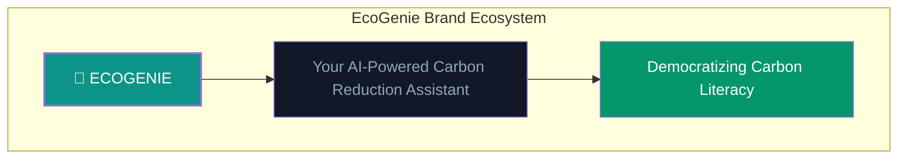
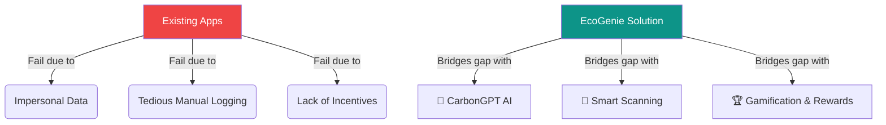
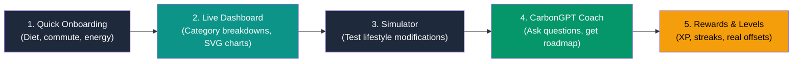
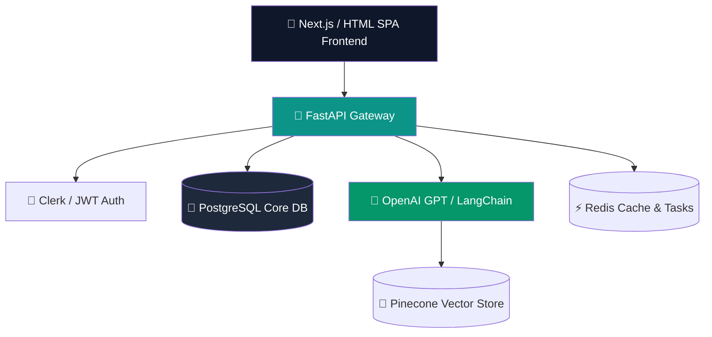
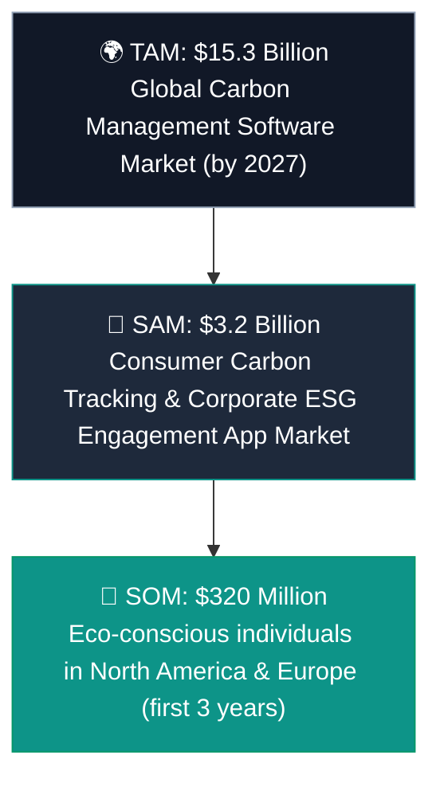
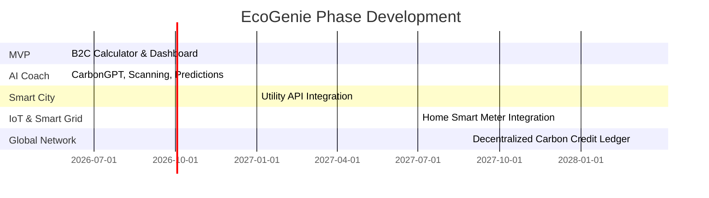
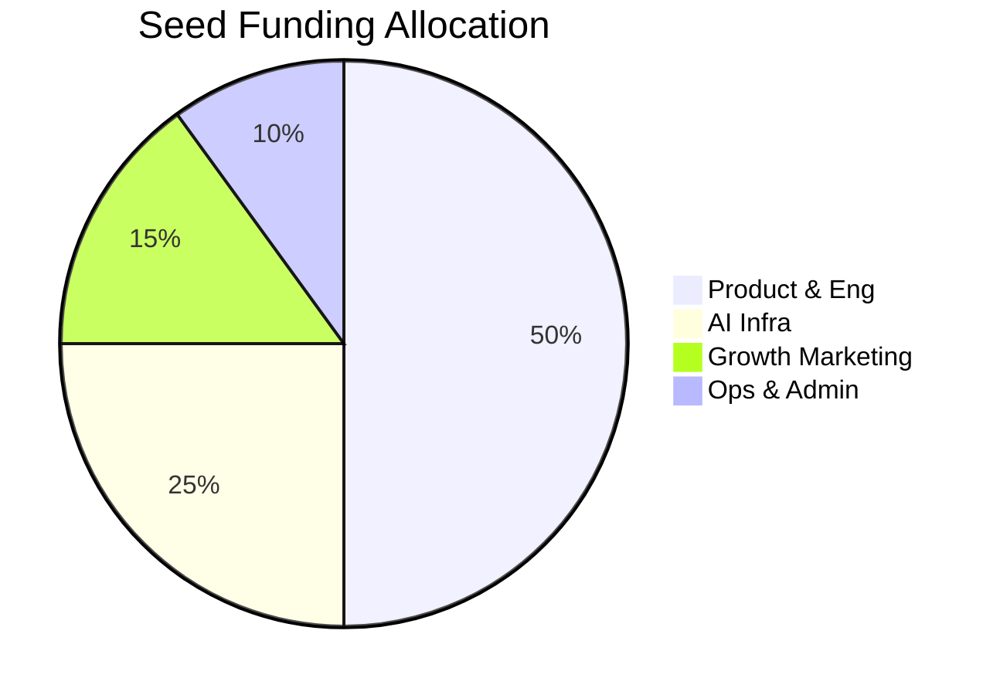

# 🚀 Section 12 — EcoGenie Startup Pitch Deck

> **ECOGENIE — Your Personal Carbon Reduction Assistant**
> *Startup Pitch Deck for Seed Round ($2M)*

---

## Slide 1: Title & Vision
### ECOGENIE: Making Sustainability Actionable & Gamified for 1 Billion People

* **Mission**: Empower individuals to track, understand, and reduce their carbon footprint by 20% in 6 months using AI and gamification.
* **Elevator Pitch**: EcoGenie is the "Duolingo + Mint for climate action," transforming carbon tracking from a boring chore into an addictive, rewarding habit.

---

## Slide 2: The Problem
### The Invisible Footprint & Climate Anxiety

* **Carbon Ignorance**: The average urban resident generates **4.5 - 8.2 tonnes of CO₂ annually**, yet 92% of people have no idea which daily activities cause the most emissions.
* **Climate Anxiety without Action**: 84% of Gen Z and Millennials report feeling moderate-to-severe anxiety about climate change, but they lack practical, personal tools to take action.
* **Carbon Literacy Gap**: People overestimate the impact of small actions (e.g., turning off a lightbulb) while severely underestimating major drivers (e.g., food waste, heating, daily commutes).

---

## Slide 3: Existing Solutions & Why They Fail
### Static Calculators & Impersonal Apps

* **Too Complex (Enterprise)**: Corporate Carbon Accounting software is too expensive, data-heavy, and irrelevant for consumer use.
* **Impracticable Calculators**: Existing web calculators are static, one-time forms that require tedious manual entry of utility bills and odometer readings. They fail to track habits over time.
* **No Motivation**: Without gamification, streaks, or a social dynamic, users download sustainability apps, use them once, and abandon them (average 30-day retention is < 3%).
* **Zero Personalization**: Traditional apps offer generic advice (e.g., "Eat less meat") without considering local geography, weather, habits, or budget constraints.

---

## Slide 4: Gap Analysis
### The Missing Bridge to Behavioral Change

* **Personalization Gap**: EcoGenie uses a **Behavioral Prediction Engine** to dynamically suggest habit shifts based on real-time user metrics.
* **Friction Gap**: We eliminate typing using **Receipt Scanning** and **Utility Bill Scanning** to extract carbon footprints automatically.
* **Reward Gap**: EcoGenie bridges the value gap by converting carbon-saving actions directly into **EcoPoints** redeemable for sustainable discounts and real-world impact.

---

## Slide 5: The Solution
### ECOGENIE — The Ultimate Sustainability Companion

* **Automatic Tracking**: Dynamic, multi-category tracking (Transport, Food, Energy, Waste, Shopping) with seamless logs.
* **CarbonGPT AI Coach**: An always-on conversational assistant answering questions, generating eco-roadmaps, and analyzing habits.
* **Carbon Reduction Simulator**: A sandbox for testing lifestyle changes (e.g., "What if I bike to work twice a week?") showing carbon saved, cash saved, and tree equivalents.
* **Community & Gamification**: A social layer with localized challenges, badges, level-ups, and a global leaderboard to drive sustained engagement.

---

## Slide 6: Product Demo
### Key User Journey & Screens

* **Onboarding**: Under 2 minutes to establish a personalized carbon baseline.
* **The Dashboard**: Live SVG visualizations of daily, weekly, and annual carbon projections.
* **The Marketplace**: Shop sustainable alternatives and claim discounts using earned points.

---

## Slide 7: AI Innovation
### The Tech Powering the Coach

* **CarbonGPT**: Custom NLP model integrated via LangChain and Vector Databases. Provides contextual answers to questions like, *"Which milk has the lowest carbon footprint?"*
* **Behavioral Prediction Engine**: An ensemble ML classifier (XGBoost/LightGBM) analyzing user activity logs to forecast future carbon trends and detect anomalous waste behaviors.
* **Smart OCR Scanners**: Extract line items from grocery receipts or kWh consumption from electricity bills, estimating footprints in real-time.

---

## Slide 8: Technical Architecture
### High-Scalability, Microservice-Driven

* **Frontend**: Next.js & Tailwind CSS for native-feeling responsive Web App.
* **Backend**: FastAPI with asynchronous database connections for low latency.
* **Database**: PostgreSQL (Structured User/Eco data) + Pinecone (Semantic Knowledge Base).
* **Deployment**: Dockerized services hosted on AWS ECS (Fargate) with auto-scaling.

---

## Slide 9: Market Size (TAM/SAM/SOM)
### Capitalizing on the Global Green Transition

* **Market Drivers**: High corporate ESG demand, government carbon compliance, rising consumer demand for green products, and carbon offset marketplaces.

---

## Slide 10: Business Model
### Multi-Tiered Monetization

* **B2C Premium Subscription**: Pro Plan at **$4.99/month** or **$39.99/year** for unlimited AI chats, bill scanning, and detailed predictive analytics.
* **B2B Enterprise ESG**: Corporate dashboard at **$99/month** per team to host employee sustainability challenges, track group ESG offsets, and generate reports.
* **E-commerce Marketplace**: **15% commission** on sustainable product purchases (reusable items, smart thermostats, eco-packaging) referred through the marketplace.
* **API Licensing**: Developer API at **$0.01 per calculation** for ecommerce checkouts, shipping carriers, and fintech apps showing transaction footprints.

---

## Slide 11: Competitive Advantage & Moats
### Why EcoGenie Wins

| Feature | EcoGenie | Carbon Footprint.com | JOULE App | Ant Forest |
|---------|:---:|:---:|:---:|:---:|
| **Real-Time AI Coach** | **✅ Yes** | ❌ No | ❌ No | ❌ No |
| **Receipt Scanning** | **✅ Yes** | ❌ No | ❌ No | ❌ No |
| **B2B & B2C Integrated** | **✅ Yes** | ❌ No | ✅ Yes | ❌ No |
| **Real Cash Rewards** | **✅ Yes** | ❌ No | ❌ No | ✅ Yes |
| **Interactive Simulator**| **✅ Yes** | ❌ No | ❌ No | ❌ No |

* **Our Moat**: The community network effect combined with proprietary user activity data, making our Behavioral Prediction Engine increasingly accurate over time.

---

## Slide 12: Go-To-Market Strategy
### Low CAC, Viral Expansion

* **Organic Viral Loops**: In-app challenge sharing (e.g., *"I just saved 15kg CO₂ this week, beat my score!"*) driving referral registrations.
* **University Partnership Program**: Launching local competitions on college campuses to capture the highly engaged 18-25 demographic.
* **Enterprise ESG Channels**: Targeting tech startups to offer EcoGenie as a free corporate benefit, acquiring thousands of users at zero cost.
* **SEO Sustainability Center**: Building a content repository of eco-tips and carbon calculations to capture high-intent search traffic.

---

## Slide 13: 3-Year Product Roadmap
### Milestones to Global Impact

* **Year 1**: Launch MVP, scale to 50K users, implement CarbonGPT coach.
* **Year 2**: Smart City transport APIs, smart home IoT meter integrations, 250K users.
* **Year 3**: Launch decentralized carbon credit marketplace, scale to 1M+ active users.

---

## Slide 14: The Ask & Use of Funds
### Fueling Our Expansion

* **The Round**: Seeking **$2,000,000 Seed Funding** (Equity round, 18-month runway).
* **Use of Funds**:
  * **50% Product & Engineering**: Hire 3 senior full-stack developers and 1 ML Engineer.
  * **25% AI Infrastructure & API**: LLM compute, Pinecone storage, API integrations.
  * **15% Growth Marketing**: University campus launches, organic loop optimization, partnerships.
  * **10% General & Administrative**: Operations, legal, accounting, compliance.

* **Contact**: invest@ecogenie.app | [www.ecogenie.app](https://www.ecogenie.app)

---

**© 2026 EcoGenie Technologies Inc. All rights reserved.**
