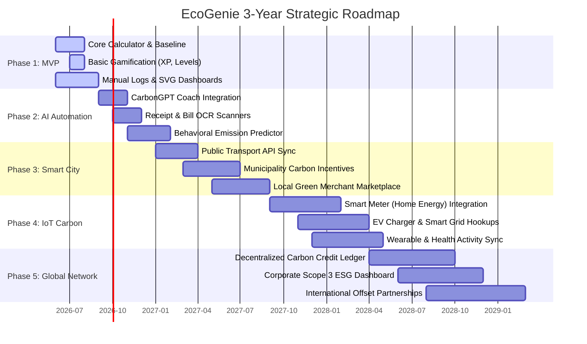
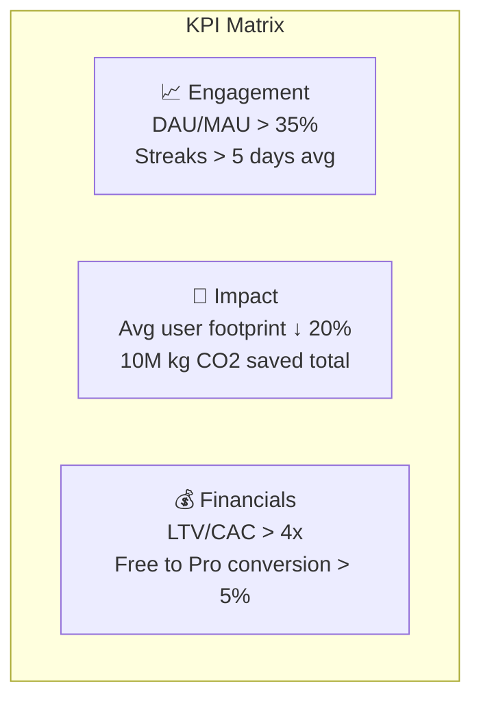

# 🗺️ Section 14 — Future Roadmap

> **EcoGenie — Personal Carbon Reduction Assistant**
> *Product Strategy, Integration Phases, and Prioritization Matrix*

---

## 14.1 5-Phase Product Roadmap

---

## 14.2 Detailed Phase Execution

### Phase 1: MVP (Months 1-3)
* **Goal**: Launch a core baseline calculator and set up initial gamification elements to validate user interest and baseline retention.
* **Deliverables**:
  * Multi-step onboarding collecting age, lifestyle, transport, and diet preferences.
  * Emission Engine calculating CO₂ across 6 major domains (Transport, Food, Energy, Water, Waste, Shopping).
  * Points, level progress (Level 1-50), and streaks to incentivize daily logging.
  * LocalStorage-persistent user profile and log history.
  * Responsive, mobile-friendly SPA design system.

### Phase 2: AI Automation (Months 4-6)
* **Goal**: Minimize manual logging friction and deploy our conversational sustainability coach.
* **Deliverables**:
  * **CarbonGPT**: Fully integrated conversational LLM with RAG support containing a detailed sustainability database.
  * **Bill & Receipt OCR**: Optical character recognition utilizing ML (e.g., Google Cloud Vision or AWS Textract) to scan utility bills and grocery receipts, extracting line items and assigning emission coefficients automatically.
  * **Ensemble Prediction Engine**: Train LightGBM/XGBoost models to predict future weekly/monthly emission patterns and highlight anomalies (e.g., sudden increase in home energy consumption).

### Phase 3: Smart City Integration (Months 7-12)
* **Goal**: Connect user activities directly to city infrastructure and transit systems.
* **Deliverables**:
  * **Transport API Integrations**: Link with city transit cards (e.g., Oyster, MTA, Metro Card) to automatically log bus, subway, and train journeys.
  * **Municipality Incentives**: Partner with city councils to convert EcoPoints into municipal rewards (e.g., parking discounts, free transit rides, municipal tax rebate credits).
  * **Local E-Commerce Marketplace**: Integrate localized eco-friendly merchants (grocers, zero-waste packaging stores, repairs) directly into our marketplace.

### Phase 4: IoT Carbon Monitoring (Year 2)
* **Goal**: Real-time passive tracking of utility and vehicular emissions.
* **Deliverables**:
  * **Smart Home Integrations**: Connect directly to utility APIs (Smart Meters, Nest, Ecobee, Philips Hue) to fetch real-time grid consumption data and optimize heating/cooling cycles via AI.
  * **EV Charger Sync**: API hooks into EV charging networks (ChargePoint, Tesla, EVgo) to calculate carbon savings relative to internal combustion engines (ICE).
  * **Wearable Integration**: Sync with Apple Health & Google Fit to track walking/biking steps, automatically rewarding active transport.

### Phase 5: Global Sustainability Network (Year 3)
* **Goal**: Scale EcoGenie into a global decentralized ledger for retail carbon offsets and enterprise Scope 3 ESG reporting.
* **Deliverables**:
  * **Decentralized Carbon Ledger**: A blockchain-backed ledger where verified individual reductions (e.g., 1000kg carbon saved) are minted as verified Carbon Offset tokens that can be purchased by corporations.
  * **Scope 3 Enterprise Dashboard**: Companies invite employees to EcoGenie, aggregating employee work-from-home/commuting offsets to claim corporate Scope 3 ESG compliance.
  * **Global Eco Projects**: Direct integration with verified offset brokers (Verra, Gold Standard) allowing users to fund tree planting, clean water, and solar projects directly.

---

## 14.3 Feature Prioritization Matrix

We utilize the **RICE Framework** (Reach, Impact, Confidence, Effort) to prioritize roadmap items:

$$\text{RICE Score} = \frac{\text{Reach} \times \text{Impact} \times \text{Confidence}}{\text{Effort}}$$

* **Reach**: Score 1-10 (How many users will this feature affect monthly?)
* **Impact**: Score 0.25 - 3 (How much will this feature drive carbon reduction / retention?)
* **Confidence**: Score 50% - 100% (How sure are we of the reach/impact estimates?)
* **Effort**: Person-Months (How long will it take to build?)

| Feature | Phase | Reach | Impact | Confidence | Effort (PM) | RICE Score | Priority |
|---------|:---:|:---:|:---:|:---:|:---:|:---:|:---:|
| **Core Carbon Calculator** | P1 | 10 | 3.0 | 100% | 1.5 | **20.0** | 🔥 Critical |
| **Gamification & Levels** | P1 | 9 | 2.5 | 90% | 1.0 | **20.25** | 🔥 Critical |
| **CarbonGPT Coach Chat** | P2 | 8 | 2.0 | 85% | 2.0 | **6.8** | ⭐ High |
| **Receipt Scanner OCR** | P2 | 8 | 2.0 | 70% | 2.5 | **4.48** | ⭐ High |
| **Utility Bill Analyzer** | P2 | 7 | 1.5 | 80% | 1.5 | **5.6** | ⭐ High |
| **Public Transit API Sync**| P3 | 6 | 2.0 | 75% | 3.0 | **3.0** | 📈 Medium |
| **Smart Meter Integration**| P4 | 5 | 2.0 | 70% | 4.0 | **1.75** | 📈 Medium |
| **Decentralized Ledger** | P5 | 3 | 2.5 | 50% | 6.0 | **0.63** | ⏳ Low |

---

## 14.4 Key Performance Indicators (KPIs)

To track roadmap success, the engineering and product teams will monitor these metric thresholds:

1. **User Growth & Retention**:
   * Day 1 Retention > 50%
   * Day 30 Retention > 35%
   * Viral K-Factor > 1.2 (each user invites at least 1.2 others)
2. **Behavioral Impact**:
   * Average daily logging events per active user: 2.2
   * Average carbon emissions saved per user per month: 85 kg CO₂
3. **API Performance**:
   * OCR parsing accuracy: > 96%
   * CarbonGPT latency: < 1.8 seconds per response

---

**© 2026 EcoGenie Technologies Inc. All rights reserved.**
