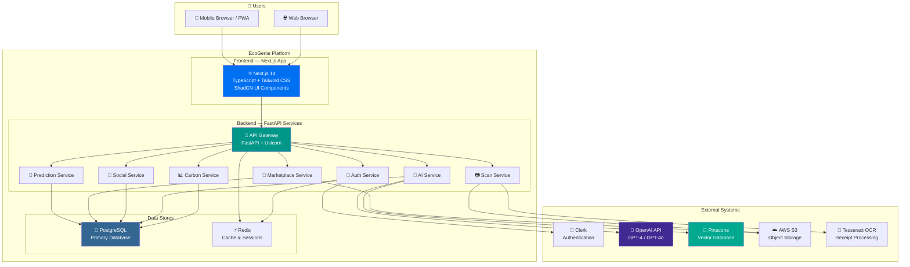
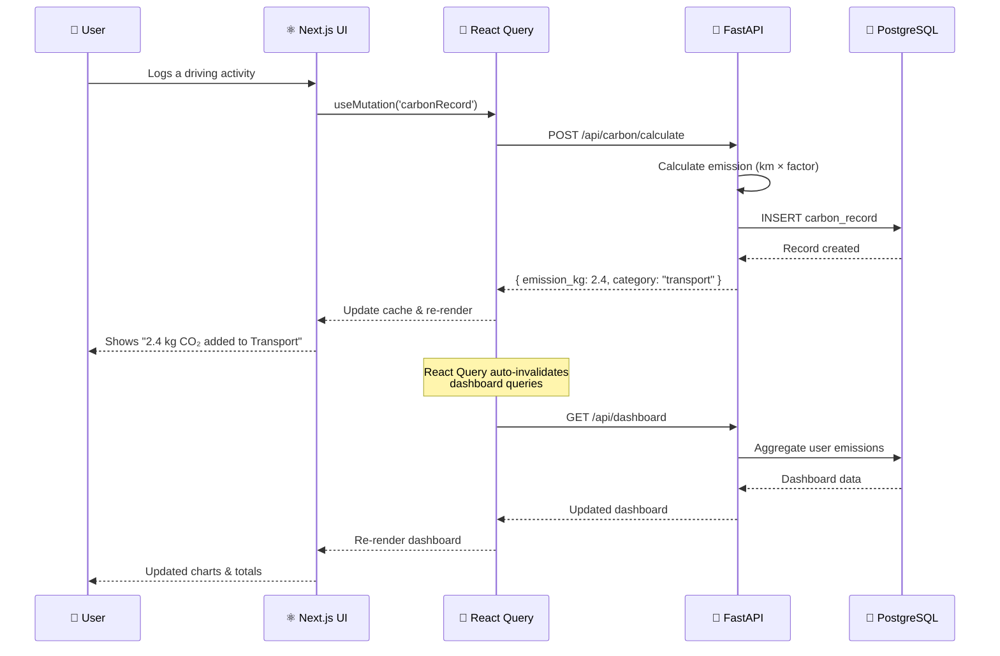
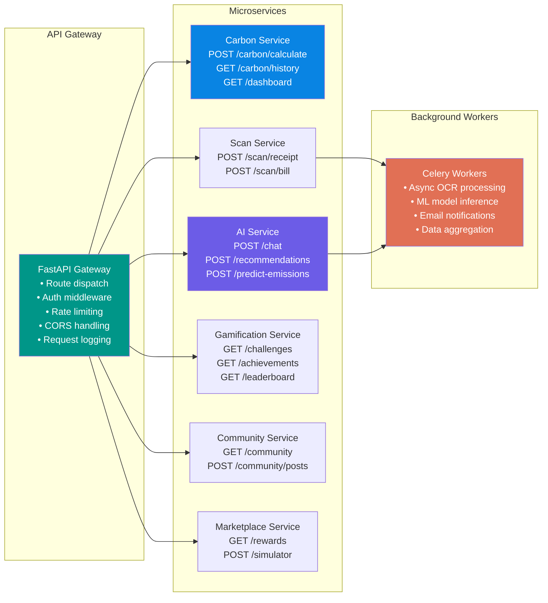
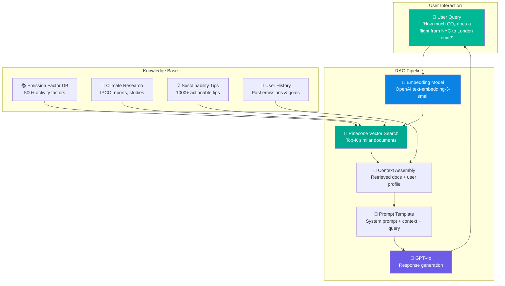
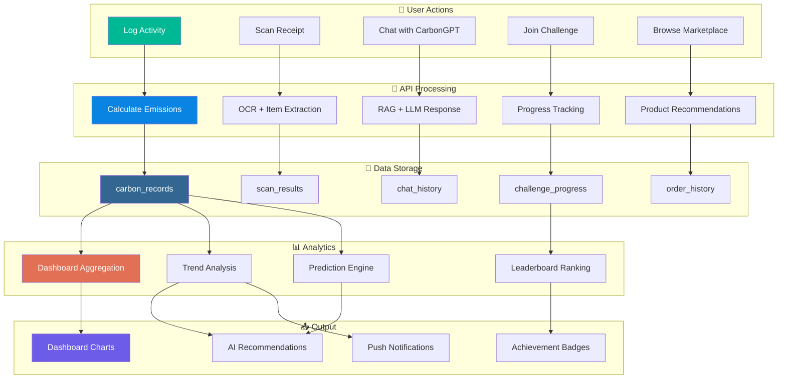
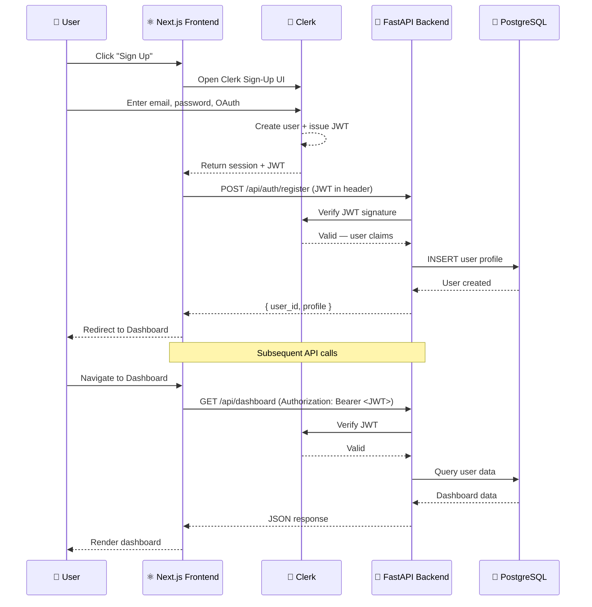
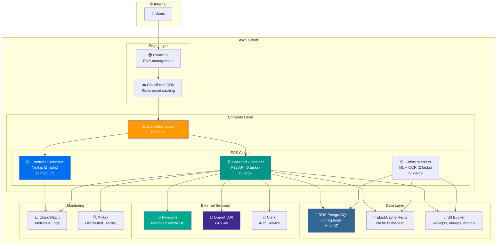
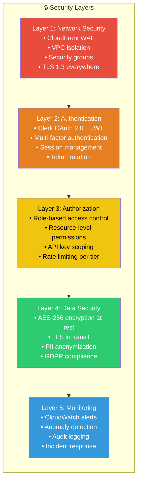
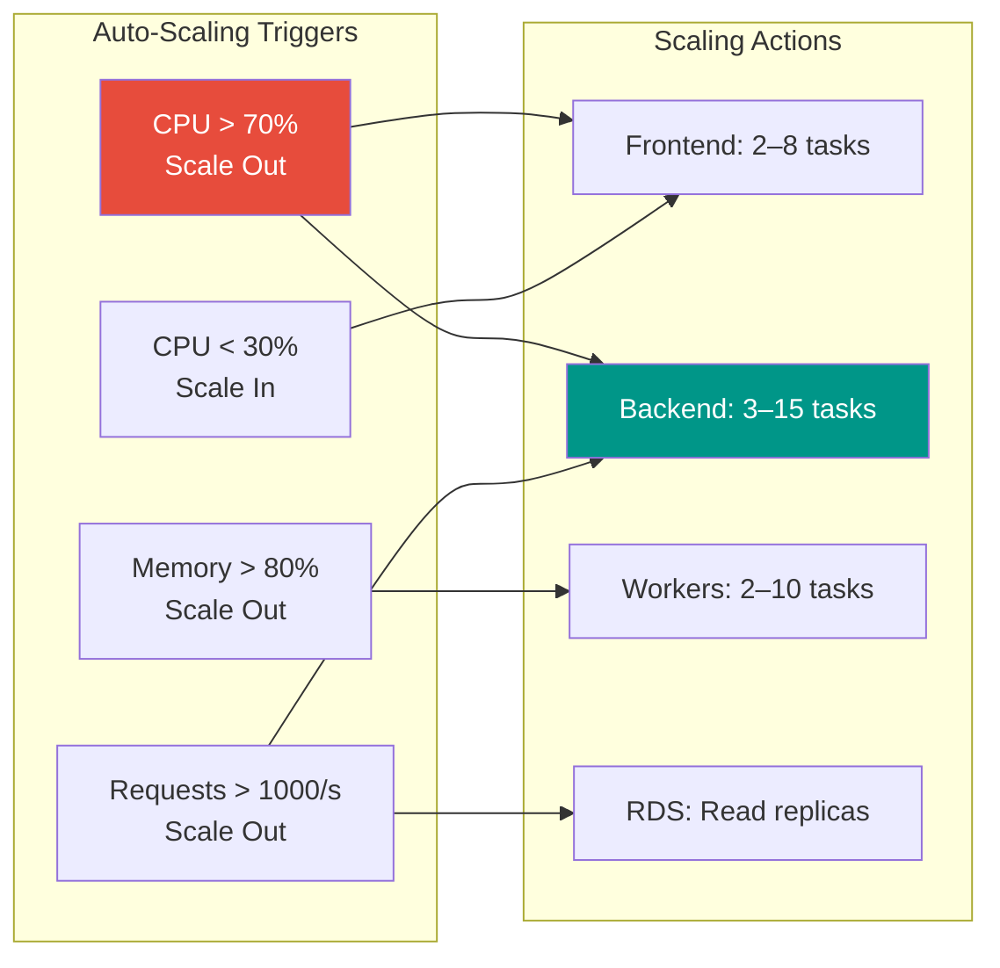

# 🏗️ Section 5 — System Architecture

> **EcoGenie — Personal Carbon Reduction Assistant**
> *Complete Technical Architecture Documentation*

---

## 5.1 Architecture Overview

EcoGenie employs a **microservices-oriented architecture** designed for scalability, maintainability, and rapid iteration. The system is structured into four primary layers:

| Layer | Responsibility | Technologies |
|-------|---------------|--------------|
| **Presentation Layer** | User interface, client-side rendering | Next.js, TypeScript, Tailwind CSS, ShadCN UI |
| **API Gateway Layer** | Request routing, authentication, rate limiting | FastAPI, Clerk Auth |
| **Service Layer** | Business logic, AI processing, data pipelines | Python, LangChain, OpenAI, LightGBM |
| **Data Layer** | Persistent storage, caching, vector search | PostgreSQL, Pinecone, AWS S3, Redis |

### Technology Stack Summary

```
┌─────────────────────────────────────────────────────────────────┐
│                        FRONTEND                                 │
│   Next.js 14 · TypeScript · Tailwind CSS · ShadCN UI · Recharts│
├─────────────────────────────────────────────────────────────────┤
│                       API GATEWAY                               │
│           FastAPI · Clerk Auth · Rate Limiting                  │
├──────────┬──────────┬──────────┬──────────┬─────────────────────┤
│  Carbon  │   AI &   │  Social  │ Scanning │  Marketplace       │
│  Service │ CarbonGPT│  Service │  Service │  Service            │
├──────────┴──────────┴──────────┴──────────┴─────────────────────┤
│                       DATA LAYER                                │
│     PostgreSQL · Pinecone · AWS S3 · Redis                     │
└─────────────────────────────────────────────────────────────────┘
```

---

## 5.2 High-Level Architecture Diagram (C4 — Context Level)



---

## 5.3 Component Diagram — All Modules

```mermaid
graph TB
    subgraph "🖥️ Frontend Application"
        direction TB
        DASH["📊 Dashboard Module<br/>• Carbon overview<br/>• Trend charts<br/>• Quick actions"]
        CALC["🧮 Calculator Module<br/>• Activity logging<br/>• Category selection<br/>• Emission display"]
        CHAT["💬 CarbonGPT Module<br/>• Chat interface<br/>• Message history<br/>• Context awareness"]
        CHAL["🏆 Challenges Module<br/>• Active challenges<br/>• Progress tracking<br/>• Leaderboard"]
        COMM["👥 Community Module<br/>• Social feed<br/>• Post creation<br/>• Likes & comments"]
        SCAN_UI["📸 Scanner Module<br/>• Camera capture<br/>• Upload interface<br/>• Results display"]
        MARKET_UI["🛒 Marketplace Module<br/>• Product catalog<br/>• Sustainability scores<br/>• Purchase flow"]
        SIM["🧪 Simulator Module<br/>• Scenario builder<br/>• Impact projections<br/>• Comparison charts"]
        PROFILE["👤 Profile Module<br/>• User settings<br/>• Achievement gallery<br/>• Reward balance"]
    end

    subgraph "⚙️ Backend Services"
        direction TB
        SVC_AUTH["Auth Service<br/>────────────<br/>• JWT management<br/>• Clerk integration<br/>• Session handling<br/>• Role-based access"]
        SVC_CARBON["Carbon Service<br/>────────────<br/>• Emission calculation<br/>• History management<br/>• Category aggregation<br/>• Trend analysis"]
        SVC_AI["AI Service<br/>────────────<br/>• CarbonGPT chat<br/>• Recommendations<br/>• RAG pipeline<br/>• Prompt management"]
        SVC_SCAN["Scan Service<br/>────────────<br/>• OCR processing<br/>• Receipt parsing<br/>• Bill analysis<br/>• Item extraction"]
        SVC_PREDICT["Prediction Service<br/>────────────<br/>• LightGBM inference<br/>• Feature engineering<br/>• Behavioral clustering<br/>• Anomaly detection"]
        SVC_SOCIAL["Social Service<br/>────────────<br/>• Community feed<br/>• Post management<br/>• Leaderboard<br/>• Comments & likes"]
        SVC_GAMIFY["Gamification Service<br/>────────────<br/>• Challenge management<br/>• Achievement tracking<br/>• Points calculation<br/>• Streak maintenance"]
        SVC_MARKET["Marketplace Service<br/>────────────<br/>• Product catalog<br/>• Order management<br/>• Sustainability scoring<br/>• Partner integration"]
    end

    DASH --> SVC_CARBON
    CALC --> SVC_CARBON
    CHAT --> SVC_AI
    CHAL --> SVC_GAMIFY
    COMM --> SVC_SOCIAL
    SCAN_UI --> SVC_SCAN
    MARKET_UI --> SVC_MARKET
    SIM --> SVC_PREDICT
    PROFILE --> SVC_AUTH

    style DASH fill:#00b894,color:#fff
    style SVC_AI fill:#6c5ce7,color:#fff
    style SVC_CARBON fill:#0984e3,color:#fff
    style SVC_PREDICT fill:#e17055,color:#fff
```



---

## 5.4 Frontend Architecture

### Technology Choices

| Technology | Version | Purpose |
|-----------|---------|---------|
| **Next.js** | 14.x | React framework with SSR, routing, and API routes |
| **TypeScript** | 5.x | Type safety and developer productivity |
| **Tailwind CSS** | 3.x | Utility-first CSS framework for rapid UI development |
| **ShadCN UI** | Latest | Pre-built accessible component library |
| **Recharts** | 2.x | Responsive charting library for carbon visualizations |
| **React Query** | 5.x | Server state management and data fetching |
| **Zustand** | 4.x | Lightweight client-side state management |
| **Clerk React** | Latest | Pre-built auth UI components |

### Directory Structure

```
frontend/
├── src/
│   ├── app/                    # Next.js App Router pages
│   │   ├── (auth)/
│   │   │   ├── login/
│   │   │   └── register/
│   │   ├── (dashboard)/
│   │   │   ├── dashboard/
│   │   │   ├── calculator/
│   │   │   ├── chat/
│   │   │   ├── challenges/
│   │   │   ├── community/
│   │   │   ├── marketplace/
│   │   │   ├── simulator/
│   │   │   └── profile/
│   │   ├── layout.tsx
│   │   └── page.tsx
│   ├── components/
│   │   ├── ui/                 # ShadCN UI components
│   │   ├── charts/             # Recharts wrappers
│   │   ├── forms/              # Form components
│   │   └── layout/             # Header, Sidebar, Footer
│   ├── hooks/                  # Custom React hooks
│   ├── lib/                    # Utility functions
│   ├── services/               # API client functions
│   ├── stores/                 # Zustand state stores
│   └── types/                  # TypeScript type definitions
├── public/                     # Static assets
├── tailwind.config.ts
├── next.config.js
└── tsconfig.json
```

### Frontend Data Flow



---

## 5.5 Backend Architecture

### Technology Choices

| Technology | Version | Purpose |
|-----------|---------|---------|
| **FastAPI** | 0.110+ | High-performance async Python web framework |
| **Uvicorn** | 0.27+ | ASGI server for production deployment |
| **SQLAlchemy** | 2.0 | ORM for database operations |
| **Alembic** | 1.13 | Database migration management |
| **Pydantic** | 2.x | Request/response validation and serialization |
| **LangChain** | 0.1+ | LLM orchestration for CarbonGPT |
| **OpenAI SDK** | 1.x | GPT-4 API integration |
| **Pinecone Client** | 3.x | Vector database for RAG |
| **Celery** | 5.x | Async task queue for background processing |
| **Redis** | 7.x | Caching, sessions, and Celery broker |

### Backend Service Architecture



### Backend Directory Structure

```
backend/
├── app/
│   ├── main.py                 # FastAPI application entry
│   ├── config.py               # Configuration & env vars
│   ├── middleware/
│   │   ├── auth.py             # Clerk JWT verification
│   │   ├── rate_limit.py       # Rate limiting middleware
│   │   └── cors.py             # CORS configuration
│   ├── routers/
│   │   ├── auth.py             # Auth endpoints
│   │   ├── carbon.py           # Carbon calculation endpoints
│   │   ├── chat.py             # CarbonGPT endpoints
│   │   ├── scan.py             # Receipt/bill scanning
│   │   ├── predict.py          # Emission prediction
│   │   ├── challenges.py       # Challenges & gamification
│   │   ├── community.py        # Social features
│   │   ├── marketplace.py      # Marketplace & rewards
│   │   └── simulator.py        # Carbon simulator
│   ├── services/
│   │   ├── carbon_service.py
│   │   ├── ai_service.py
│   │   ├── scan_service.py
│   │   ├── prediction_service.py
│   │   ├── gamification_service.py
│   │   ├── community_service.py
│   │   └── marketplace_service.py
│   ├── models/                 # SQLAlchemy models
│   ├── schemas/                # Pydantic schemas
│   ├── ml/                     # ML model files & inference
│   │   ├── lightgbm_model.pkl
│   │   ├── feature_pipeline.py
│   │   └── inference.py
│   └── utils/
│       ├── emission_factors.py
│       └── helpers.py
├── migrations/                 # Alembic migrations
├── tests/                      # Pytest test suite
├── requirements.txt
└── Dockerfile
```

---

## 5.6 AI & Machine Learning Layer

### CarbonGPT Architecture (RAG Pipeline)



### ML Models Deployed

| Model | Algorithm | Purpose | Input Features | Output |
|-------|-----------|---------|----------------|--------|
| Emission Predictor | LightGBM | Forecast user's future emissions | Demographics, history, weather, time | Predicted monthly CO₂ (kg) |
| Behavioral Cluster | K-Means | Segment users by lifestyle patterns | Activity categories, frequencies, amounts | Cluster label (1-5) |
| Anomaly Detector | Isolation Forest | Flag unusual emission spikes | Daily/weekly emission patterns | Anomaly score (0-1) |
| Receipt Parser | OCR + NER | Extract items from receipt images | Receipt image (JPEG/PNG) | List of items + quantities |

---

## 5.7 Data Flow Diagram



---

## 5.8 Authentication Flow



---

## 5.9 Deployment Architecture

### Cloud Infrastructure (AWS)



### Docker Configuration

```yaml
# docker-compose.yml (Development)
version: "3.9"

services:
  frontend:
    build: ./frontend
    ports:
      - "3000:3000"
    environment:
      - NEXT_PUBLIC_API_URL=http://backend:8000
      - NEXT_PUBLIC_CLERK_PUBLISHABLE_KEY=${CLERK_PK}
    depends_on:
      - backend

  backend:
    build: ./backend
    ports:
      - "8000:8000"
    environment:
      - DATABASE_URL=postgresql://user:pass@db:5432/ecogenie
      - OPENAI_API_KEY=${OPENAI_KEY}
      - PINECONE_API_KEY=${PINECONE_KEY}
      - CLERK_SECRET_KEY=${CLERK_SK}
      - REDIS_URL=redis://redis:6379
      - AWS_S3_BUCKET=${S3_BUCKET}
    depends_on:
      - db
      - redis

  celery_worker:
    build: ./backend
    command: celery -A app.celery worker -l info
    environment:
      - REDIS_URL=redis://redis:6379
      - DATABASE_URL=postgresql://user:pass@db:5432/ecogenie
    depends_on:
      - redis
      - db

  db:
    image: postgres:16-alpine
    ports:
      - "5432:5432"
    environment:
      - POSTGRES_DB=ecogenie
      - POSTGRES_USER=user
      - POSTGRES_PASSWORD=pass
    volumes:
      - pgdata:/var/lib/postgresql/data

  redis:
    image: redis:7-alpine
    ports:
      - "6379:6379"

volumes:
  pgdata:
```

---

## 5.10 Security Architecture



### Security Measures Summary

| Category | Implementation | Standard |
|----------|---------------|----------|
| Authentication | Clerk with JWT, MFA support | OAuth 2.0 / OIDC |
| Authorization | RBAC with scoped permissions | OWASP best practices |
| Data Encryption | AES-256 at rest, TLS 1.3 in transit | SOC 2 Type II |
| API Security | Rate limiting, input validation, CORS | OWASP API Top 10 |
| Data Privacy | PII anonymization, right to deletion | GDPR, CCPA |
| Infrastructure | VPC, security groups, WAF | AWS Well-Architected |
| Monitoring | Real-time alerts, audit logs | ISO 27001 |
| CI/CD Security | SAST, dependency scanning | DevSecOps |

---

## 5.11 Scalability Strategy

| Growth Stage | Users | Infrastructure | Estimated Monthly Cost |
|-------------|:---:|----------------|:---:|
| **MVP** | 0–1K | Single ECS task, RDS db.t3.medium | $150/mo |
| **Early Growth** | 1K–10K | 2 tasks, RDS db.r6g.large | $500/mo |
| **Scaling** | 10K–100K | Auto-scaling ECS, RDS Multi-AZ, ElastiCache | $2,500/mo |
| **Mature** | 100K–1M | Multi-region, read replicas, dedicated workers | $8,000/mo |
| **Enterprise** | 1M+ | Multi-region active-active, dedicated Pinecone | $25,000/mo |

### Auto-Scaling Policies



---

## 5.12 Performance Requirements

| Metric | Target | Measurement |
|--------|--------|-------------|
| API Response Time (p50) | < 100ms | CloudWatch latency |
| API Response Time (p99) | < 500ms | CloudWatch latency |
| CarbonGPT Response Time | < 3s | End-to-end including LLM |
| Receipt Scan Processing | < 5s | OCR + extraction pipeline |
| Dashboard Load Time | < 2s | Lighthouse FCP |
| Uptime SLA | 99.9% | Monthly availability |
| Concurrent Users | 10,000+ | Load test validation |
| Database Query Time (p95) | < 50ms | PostgreSQL slow query log |

---

**© 2026 EcoGenie — System Architecture Document v1.0**
